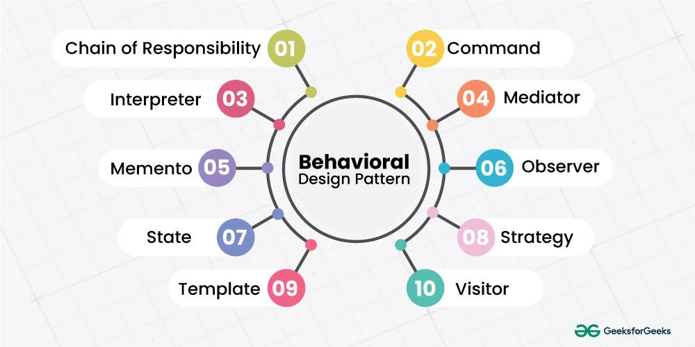

## Behavioral Design Patterns

*Behavioral Patterns are concerned with algorithms and the assignment of responsibilities between objects. Behavioral patterns describe not just patterns of objects or classes but also the patterns of communication between them. These patterns characterize complex control flow that’s difficult to follow at run-time.*

There are three recurring themes in these patterns:

1. Behavioral class patterns use inheritance to distribute behavior between classes.
2. Behavioral object patterns use object composition rather than inheritance.
3. Behavioral object patterns are concerned with encapsulating behavior in an object and delegating requests to it.

1. **Chain Of Responsibility Method Design Pattern**
Chain of Responsibility method and Chain of Responsibility design pattern it avoid coupling the sender of request to its receiver by giving more than one object a chance to handle the request. Chain the receiving objects and pass the request along the chain until an object handles it.

**When to use Chain of Responsibility Method**
- More than one object may handle a request, and the handler isn’t known a priori. The handler should be ascertained automatically.
- You want to issue a request to one of several objects without specifying the receiver explicitly
- The set of objects that can handle a request should be specified dynamically.
2. **Command Method Design Pattern**
Command method or Command Design Pattern also known as Action, Transaction. It encapsulate a request an object, parameterize clients with different requests, queue or log requests and support undoable operations.

**When to use Command Method**:
- We can express parameterization in a procedural language with a call back function, that is, a function that’s registered somewhere to be called. Command are an object-oriented replacement for callbacks.
- Specify, queue, and execute requests at different times. A command object have a lifetime independent of the original request. If the receiver of a request can be represented in an address space-independent way, then we can transfer a command object for the request to a different process and fulfill the request.
- Support undo. The Command’s Execute operation can store state for reversing its effects in the command itself.
- Support logging changes so that they can be reapplied in case of a system crash. By augmenting the Command interface with load and store operations.
- Structure a system around high-level operations build on primitives operations. Such a structure is common in information systems that support transactions.
3. **Interpreter Method Design Patterns**
Interpreter method or Interpreter Design Pattern, it define a representation for its grammer along with an interpreter that uses the representation to interpret sentences in the language.

**When to use Interpreter Method**:
- There is a language to interpret, and you can represent statements in the language as a abstract syntax trees,

- The grammer is simple. For complex grammars, the class hierarchy for the grammer becomes large and unmanageable. Tools such as parser generators are better alternatives. They can interpret expressions without building abstract syntax tree, which can save space and possibly time.
- Efficiency is not a critical concern. The most efficient interpreters are usually not implemented by interpreting parse trees directly but by first translating them into another form.
4. **Mediator Method Design Pattern**
Mediator method or mediator design pattern, it define an object that enacapsulates how a set of objects interact. Mediator promotes loose coupling by keeping objects from referring to each other explicity, and it vary from their interaction independently.

**When to use Mediator Method**:
- A set of objects communicatein well-defined but complex ways.The resulting interdependencies are unstructured and difficult to understand.
- Reusing an object is difficult because itrefers to and communicates with many other objects.
- Behavior that’s distributed between several classes should be customizable without a lot of subclassing.
5. **Memento Method Design Patterns**
Memento method or Memento Design Pattern are know as token. Without violating encapsulation, capture, and externalize an object’s internal state so that the object can be restored to this state later.

**When to use Memento Method**:
- A snapshot of (some portion of) an object’s state must be saved so that it can be restored to that state later.
- A direct interface to obtaining the state would expose implementation details and break the object’s encapsulation.
6. **Observer Method Design Pattern**
Observer method or Observer design pattern also known as dependents and publish-subscribe. It define a one to many dependancy between objects so that when one objects so that when one object change state, all its dependents are notified and updated automatically.

**When to use Observer Method**:
Use the Observer pattern in any of the following situations:

- When an abstraction has two aspects, one dependent on the other. Encapsulating these aspects in separate objects lets you vary and reuse them independently.
- When a change to one object requires changing others, and you don’t know how many objects need to be changed.
- When an object should be able to notify other objects without making assumptions about who these objects are.In other words, you don’t want these objects tightly coupled.
7. **State Method Design Pattern**
State method or State Design Pattern also known as objects for states, it allow an object to alter its behaviour when its internal state changes. The object will appear to change its class.

**When to use State Method**:
Use the State pattern in either of the following cases:

- An object’s behavior depends on its state, and it must change its behavior at run-time depending on that state.
- Operations have large, multipart conditional statements that depend on the object’s state. This state is usually represented by one or more enumerated constants. Often, several operations will contain this same conditional structure. The State pattern puts each branch ofthe conditional in a separate class. This lets you treat the object’s state as an object in its own right that can vary independently from other objects.
8. **Strategy Method Design Pattern**
Strategy method or Strategy Design Pattern also known as Policy, it define a family of algorithm, encapsulate each one, and make them interchangeable. Strategy lets the algorithm vary independently from clients that use it.

**When to use Strategy Method**:
- Many related classes differ only in their behavior. Strategies provide a way to configure a class with one of many behaviors.
- We need different variants of an algorithm. For example, you might define algorithms reflecting different space/time trade-offs. Strategies can be used when these variants are implemented as a class hierarchy of algorithms .
- An algorithm uses data that clients shouldn’t know about. Use the Strategy pattern to avoid exposing complex, algorithm-specific data structures.
- A class defines many behaviors, and these appear as multiple conditional statements in its operations. Instead of many conditionals, move related conditional branches into their own Strategy class.
9. Template Method Design Pattern
Template method or Template Design Pattern, it define the skeleton of an algorithm in an operation, deferring some steps to subclasses. Template Method lets subclasses redefine certain steps of an algorithm without changing the algorithm’s structure.

**When to use Template Method**:
- To implement the invariant parts of an algorithm once and leave it up to subclasses to implement the behavior that can vary.
When common behavior among subclasses should be factored and localized in a common class to avoid code duplication. This is a good example of “refactoring to generalize” as described by Opdyke and Johnson You first identify the differences in the existing code and then separate the differences into new operations. Finally, you replace the differing code with a template method that calls one of these new operations.
- To control subclasses extensions. You can define a template method that calls “hook” operations (see Consequences) at specific points, thereby permitting extensions only at those points.

10. **Visitor Method Design Pattern**
Visitor method or Visitor Design Pattern, it represent an operation to be performed on the elements of an object structure. Visitor define a new operation without changing the classes of the elements on which it operates.

**When to use Visitor Method**
- An object structure contains many classes of objectswith differing interfaces, and you want to perform operations on these objects that depend on their concrete classes.
- Many distinct and unrelated operations need to be performed on objects in an object structure, and you want to avoid “polluting” their classes with these operations. Visitor lets you keep related operations together by defining them in one class. When the object structure is shared by many applications, use Visitor to put operations in just those applications that need them.
- The classes defining the object structure rarely change, but you often want to define new operations over the structure. Changing the object structure classes requires redefining the interface to all visitors, which is potentially costly. Ifthe object structure classes change often, then it’s probably better to define the operations in those classes.
