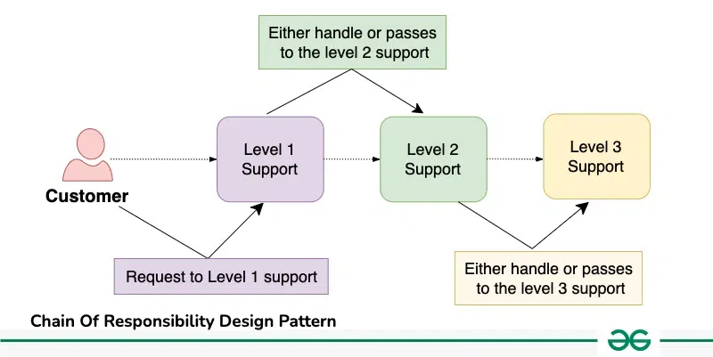
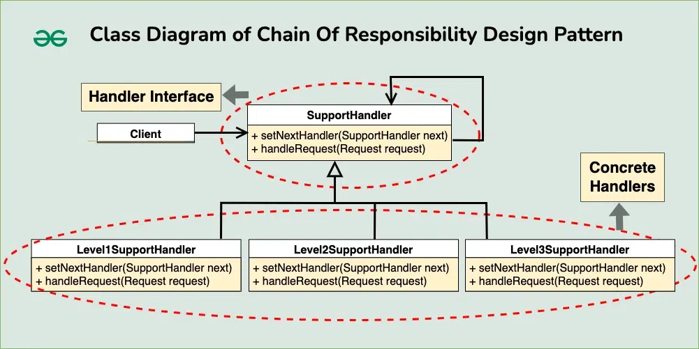

## Chain of Responsibility Design Pattern

Chain of Responsibility Pattern or Chain of Responsibility Method is a Behavioral Design Pattern, which allows an object to send a request to other objects without knowing who is going to handle it.

- This pattern is frequently used in the chain of multiple objects, where each object either handles the request or passes it on to the next object in the chain if it is unable to handle that request.
- This pattern encourages loose coupling between sender and receiver, providing freedom in handling the request.



Components of the Chain of Responsibility Design Pattern
The Chain of Responsibility Pattern consists of the following key components:

1. **Handler Interface or Abstract Class** : This is the base class that defines the interface for handling requests and, in many cases, for chaining to the next handler in the sequence.

2. **Concrete Handlers** : These are the classes that implement how the requests are going to be handled. They can handle the request or pass it to the next handler in the chain if it is unable to handle that request.

3. **Client** : The request is sent by the client, who then forwards it to the chain’s first handler. Which handler will finally handle the request is unknown to the client.

### Example
#### Customer Support
Imagine a customer support system where customer requests need to be handled based on their priority. There are three levels of support: Level 1, Level 2, and Level 3. Level 1 support handles basic requests, Level 2 support handles more complex requests, and Level 3 support handles critical issues that cannot be resolved by Level 1 or Level 2.


Handler Interface
```java
public interface SupportHandler {
    void handleRequest(Request request);
    void setNextHandler(SupportHandler nextHandler);
}
```

Concrete handlers
```java
public class Level1SupportHandler implements SupportHandler {
    private SupportHandler nextHandler;

    public void setNextHandler(SupportHandler nextHandler) {
        this.nextHandler = nextHandler;
    }

    public void handleRequest(Request request) {
        if (request.getPriority() == Priority.BASIC) {
            System.out.println("Level 1 Support handled the request.");
        } else if (nextHandler != null) {
            System.out.println("Level 1 Support passing the request to Level 2 Support");
            nextHandler.handleRequest(request);
        }
    }
}

public class Level2SupportHandler implements SupportHandler {
    private SupportHandler nextHandler;

    public void setNextHandler(SupportHandler nextHandler) {
        this.nextHandler = nextHandler;
    }

    public void handleRequest(Request request) {
        if (request.getPriority() == Priority.INTERMEDIATE) {
            System.out.println("Level 2 Support handled the request.");
        } else if (nextHandler != null) {
            System.out.println("Level 2 Support passing the request to Level 3 Support");
            nextHandler.handleRequest(request);
        }
    }
}

public class Level3SupportHandler implements SupportHandler {
    public void handleRequest(Request request) {
        if (request.getPriority() == Priority.CRITICAL) {
            System.out.println("Level 3 Support handled the request.");
        } else {
            System.out.println("Request cannot be handled.");
        }
    }

    public void setNextHandler(SupportHandler nextHandler) {
        // No next handler for Level 3
    }
}
```

Client
```java
// Priority Enum
enum Priority {
    BASIC, INTERMEDIATE, CRITICAL
}

// Main Class
public class Main {
    public static void main(String[] args) {
        SupportHandler level1Handler = new Level1SupportHandler();
        SupportHandler level2Handler = new Level2SupportHandler();
        SupportHandler level3Handler = new Level3SupportHandler();

        level1Handler.setNextHandler(level2Handler);
        level2Handler.setNextHandler(level3Handler);

        Request request1 = new Request(Priority.BASIC);
        Request request2 = new Request(Priority.INTERMEDIATE);
        Request request3 = new Request(Priority.CRITICAL);

        level1Handler.handleRequest(request1);
        level1Handler.handleRequest(request2);
        level1Handler.handleRequest(request3);
    }
}
```

Output
```
Level 1 Support handled the request.
Level 1 Support passing the request to Level 2 Support
Level 2 Support handled the request.
Level 1 Support passing the request to Level 2 Support
Level 2 Support passing the request to Level 3 Support
Level 3 Support handled the request.
```

#### Logging System
Handler Interface
```java
public abstract class LogProcessor {
    LogProcessor nextLogProcessor;
    public LogProcessor(LogProcessor logProcessor) {
        nextLogProcessor = logProcessor;
    }

    void log(LogLevel logLevel, String message) {
        if (nextLogProcessor != null) {
            nextLogProcessor.log(logLevel, message)
        }
        else {
            System.out.println("No Suitable Logger Found");
        }
    }
}
```
Concrete handlers
```java
public class InfoLogProcessor extends LogProcessor {
    public InfoLogProcessor(LogProcessor nextLogProcessor) {
        super(nextLogProcessor);
    }

    public void log(LogLevel logLevel, message) {
        if (logLevel == LogLevel.INFO) {
            System.out.println(message);
        }
        else {
            super.log(logLevel, message);
        }
    }
}

public class DebugLogProcessor extends LogProcessor {
    public DebugLogProcessor(LogProcessor nextLogProcessor) {
        super(nextLogProcessor);
    }

    public void log(LogLevel logLevel, message) {
        if (logLevel == LogLevel.DEBUG) {
            System.out.println(message);
        }
        else {
            super.log(logLevel, message);
        }
    }
}
```

Client
```java
enum LogLevel {
    INFO, DEBUG, ERROR
}

public class TestClass {
    public static void main(String args[]) {
        LogProcessor logObj = new InfoLogProcessor(new DebugLogProcessor(null));

        logObj.log(LogLevel.INFO, "some info message");
        logObj.log(LogLevel.ERROR, "some error message");
    }
}

```


Output
```
some info message
No Suitable Logger Found
```

