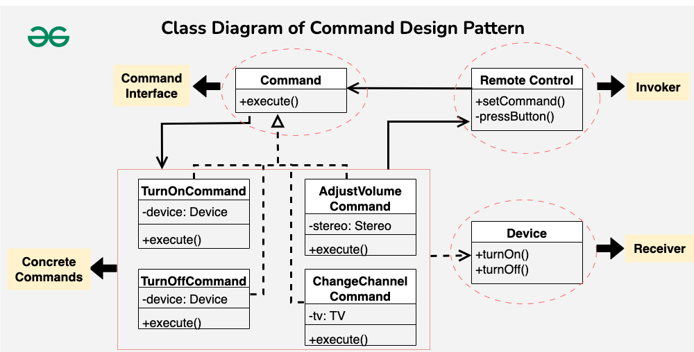

## Command Design Pattern

The Command Design Pattern is a behavioral design pattern that turns a request into a stand-alone object, allowing parameterization of clients with different requests, queuing of requests, and support for undoable operations(action or a series of actions that can be reversed or undone in a system).

### Components of the Command Design Pattern
1. **Command Interface** : The Command Interface is like a rulebook that all command classes follow. It declares a common method, execute(), ensuring that every concrete command knows how to perform its specific action. It sets the standard for all commands, making it easier for the remote control to manage and execute diverse operations without needing to know the details of each command.

2. **Concrete Command Classes** : Concrete Command Classes are the specific commands, like turning on a TV or adjusting the stereo volume. Each class encapsulates the details of a particular action. These classes act as executable instructions that the remote control can trigger without worrying about the nitty-gritty details of how each command accomplishes its task.

3. **Invoker (Remote Control)** : The Invoker, often a remote control, is the one responsible for initiating command execution. It holds a reference to a command but doesn’t delve into the specifics of how each command works. It’s like a button that, when pressed, makes things happen. The remote control’s role is to coordinate and execute commands without getting involved in the complexities of individual actions.

4. **Receiver (Devices)** : The Receiver is the device that knows how to perform the actual operation associated with a command. It could be a TV, stereo, or any other device. Receivers understand the specific tasks mentioned in commands. If a command says, “turn on,” the Receiver (device) knows precisely how to execute that action. The Receiver-Command relationship separates responsibilities, making it easy to add new devices or commands without messing with existing functionality.

### Example
#### Television Remote
*Imagine you are tasked with designing a remote control system for various electronic devices in a smart home. The devices include a TV, a stereo, and potentially other appliances. The goal is to create a flexible remote control that can handle different types of commands for each device, such as turning devices on/off, adjusting settings, or changing channels.*



Command Interface
```java
public interface ICommand {
    void execute();
}
```

Concrete Command Classes
```java
// Concrete command for turning a device on
public class TurnOnCommand implements ICommand {
	private Device device;

	public TurnOnCommand(Device device) {
		this.device = device;
	}

	@Override
	public void execute() {
		device.turnOn();
	}
}

// Concrete command for turning a device off
public class TurnOffCommand implements ICommand {
	private Device device;

	public TurnOffCommand(Device device) {
		this.device = device;
	}

	@Override
	public void execute() {
		device.turnOff();
	}
}

// Concrete command for adjusting the volume of a stereo
public class AdjustVolumeCommand implements ICommand {
	private Stereo stereo;

	public AdjustVolumeCommand(Stereo stereo) {
		this.stereo = stereo;
	}

	@Override
	public void execute() {
		stereo.adjustVolume();
	}
}

// Concrete command for changing the channel of a TV
public class ChangeChannelCommand implements ICommand {
	private TV tv;

	public ChangeChannelCommand(TV tv) {
		this.tv = tv;
	}

	@Override
	public void execute() {
		tv.changeChannel();
	}
}

```

Receiver Classes (Devices)
```java
public interface Device {
    void turnOn();
    void turnOff();
}
 
// Concrete receiver for a TV
public class TV implements Device {
    @Override
    public void turnOn() {
        System.out.println("TV is now on");
    }
 
    @Override
    public void turnOff() {
        System.out.println("TV is now off");
    }
 
    public void changeChannel() {
        System.out.println("Channel changed");
    }
}
 
// Concrete receiver for a stereo
public class Stereo implements Device {
    @Override
    public void turnOn() {
        System.out.println("Stereo is now on");
    }
 
    @Override
    public void turnOff() {
        System.out.println("Stereo is now off");
    }
 
    public void adjustVolume() {
        System.out.println("Volume adjusted");
    }
}
```

Invoker
```java
public class RemoteControl {
    private ICommand command;
 
    public void setCommand(ICommand command) {
        this.command = command;
    }
 
    public void pressButton() {
        command.execute();
    }
}
```

Example
```java
public class CommandPatternExample {
    public static void main(String[] args) {
        // Create devices
        TV tv = new TV();
        Stereo stereo = new Stereo();
 
        // Create command objects
        ICommand turnOnTVCommand = new TurnOnCommand(tv);
        ICommand turnOffTVCommand = new TurnOffCommand(tv);
        ICommand adjustVolumeStereoCommand = new AdjustVolumeCommand(stereo);
        ICommand changeChannelTVCommand = new ChangeChannelCommand(tv);
 
        // Create remote control
        RemoteControl remote = new RemoteControl();
 
        // Set and execute commands
        remote.setCommand(turnOnTVCommand);
        remote.pressButton(); // Outputs: TV is now on
 
        remote.setCommand(adjustVolumeStereoCommand);
        remote.pressButton(); // Outputs: Volume adjusted
 
        remote.setCommand(changeChannelTVCommand);
        remote.pressButton(); // Outputs: Channel changed
 
        remote.setCommand(turnOffTVCommand);
        remote.pressButton(); // Outputs: TV is now off
    }
}
```

Output
```
TV is now on
Volume adjusted
Channel changed
TV is now off
```

#### Television Example with Undo/Redo
Add Stack in the Invoker

```java
import java.util.Stack;

public class RemoteControl {
    Stack<ICommand> commandHistory = new Stack();
    ICommand command;
 
    public void setCommand(ICommand command) {
        this.command = command;
    }
 
    public void pressButton() {
        command.execute();
        commandHistory.add(command)
    }

    public void undo() {
        if (!commandHistory.isEmpty()) {
            ICommand lastCommand = commandHistory.pop();
            lastCommand.execute();
        }
    }
}
```