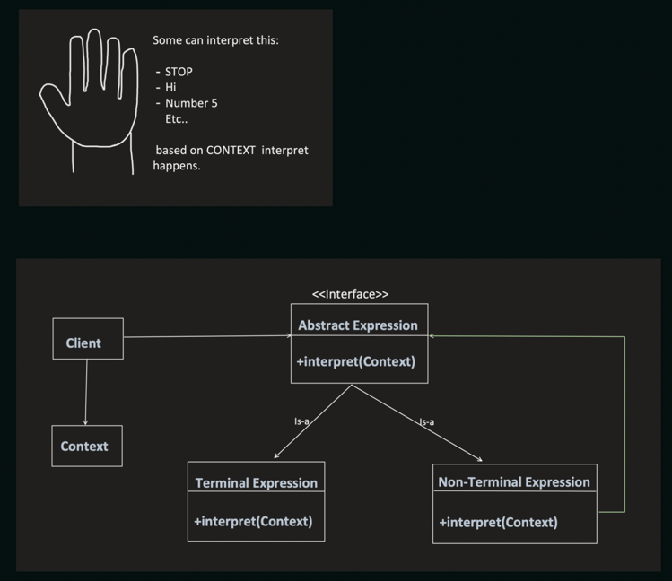
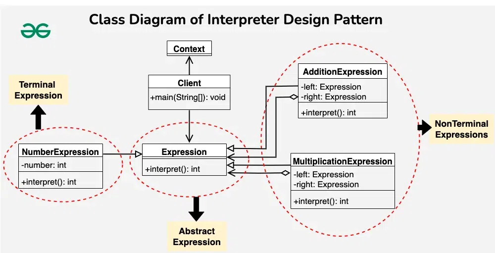

## Interpreter Design Pattern

The Interpreter design pattern is a behavioral design pattern that facilitates the interpretation and evaluation of expressions or language grammars.



- The pattern involves defining a hierarchy of expression classes, both terminal and nonterminal, to represent the elements of the language’s grammar.
- Terminal expressions represent basic building blocks, while nonterminal expressions represent compositions of these building blocks.
- The tree structure of the Interpreter design pattern is somewhat similar to that defined by the composite design pattern with terminal expressions being leaf objects and non-terminal expressions being composites.

***This involves defining the behavior of interpreting expressions, parsing input strings, building expression trees, and recursively evaluating expression nodes based on predefined grammar rules.***


### Example


#### Arithmatic Expression Evaluator
Context (Information needed for interpretation)
```java
public class Context {
    Map<String, Integer> contextMap = new HashMap<>();

    public void put(String strVariable, int value) {
        contextMap.put(strVariable, int value);
    }

    public int get(String strVariable) {
        return contextMap.get(strVariable);
    }
}

```

Abstract Expression

```java
public interface Expression {
    int interpret(Context context);
}
```

Terminal Expression
```java
public class NumberExpression implements Expression {
	String strValue;

	public NumberExpression(String strValue) {
		this.strValue = strValue;
	}

	@Override
	public int interpret(Context context) {
		return context.get(strValue);
	}
}

```

Non-Terminal Expressions
```java
public class AdditionExpression implements Expression {
    private Expression left;
    private Expression right;
 
    public AdditionExpression(Expression left, Expression right) {
        this.left = left;
        this.right = right;
    }
 
    @Override
    public int interpret(Context context) {
        return left.interpret(context) + right.interpret(context);
    }
}
 
public class MultiplicationExpression implements Expression {
    private Expression left;
    private Expression right;
 
    public MultiplicationExpression(Expression left, Expression right) {
        this.left = left;
        this.right = right;
    }
 
    @Override
    public int interpret(Context context) {
        return left.interpret(context) * right.interpret(context);
    }
}
```

Client
```java
public class Client {
    public static void main(String args[]) {
        Context context = new Context();

        context.put("a", 5);
        context.put("b", 6);
        context.put("c", 3);
        context.put("d", 7);

        // a*b
        AbstractExpression absExpression = new MultiplicationExpression(new NumberExression(a), new NumberExpression(b));

        System.out.println(absExpression.interpret(context));

        // (a*b) + (c*d)
        AbstractExpression absExpression2 = new AdditionExpression(new MultiplicationExpression(new NumberExpression(a), new NumberExpression(b)), new MultiplicationExpression(new NumberExpression(c), new NumberExpression(d)));

        System.out.println(absExpression2.interpret(context));
    }
}
```

#### Arithmatic Expression Evaluator using Single Non-Terminal Class

BinaryNonTerminalExpression

```java
public class BinaryNonTerminalExpression implements Expression {
    private AbstractExpression left;
    private AbstractExpression right;
    char operator;

    public BinaryNonTerminalExpression(AbstractExpression left, AbstractExpression right, char operator) {
        this.left = left;
        this.right = right;
        this.operator = operator;
    }
 
    @Override
    public int interpret(Context context) {
        switch (operator) {
            case '*':
                return left.interpret(context) * right.interpret(context);
            case '+':
                return left.interpret(context) + right.interpret(context);
            case '-':
                return left.interpret(context) - right.interpret(context);
            case '/':
                return left.interpret(context) / right.interpret(context);
            default:
                return 0;
        }
    }
}
```

Client
```java
public class Client {
    public static void main(String args[]) {
        Context context = new Context();

        context.put("a", 5);
        context.put("b", 6);
        context.put("c", 3);
        context.put("d", 7);

        // (a*b) + (c*d)
        AbstractExpression absExpression2 = new BinaryNonTerminalExpression(
                new BinaryNonTerminalExpression(new NumberExpression(a), new NumberExpression(b), '*'), 
                new BinaryNonTerminalExpression(new NumberExpression(c), new NumberExpression(d), '*')
            );

        System.out.println(absExpression2.interpret(context));
    }
}
```