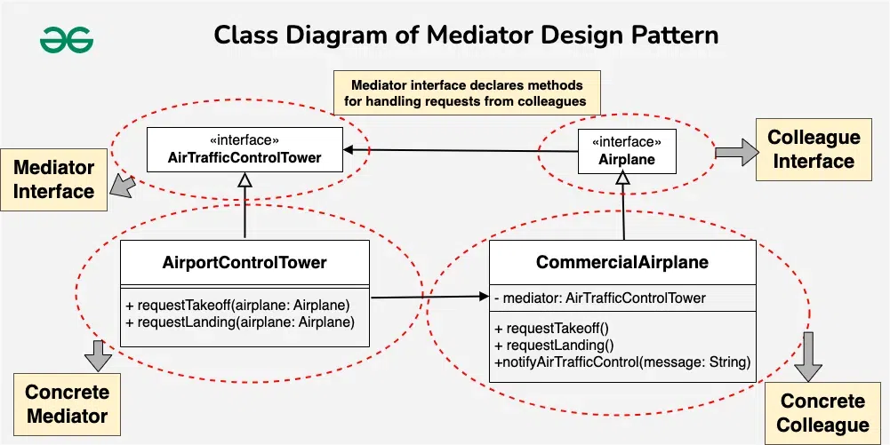

## Mediator design pattern

*It defines how a mediator object facilitates the interaction between other objects, guiding their behavior and communication without them being directly aware of each other. This pattern emphasizes the behavior and communication patterns among objects.*

### Components of the Mediator Design Pattern
1. **Mediator** : The Mediator interface defines the communication contract, specifying methods that concrete mediators should implement to facilitate interactions among colleagues.. It encapsulates the logic for coordinating and managing the interactions between these objects, promoting loose coupling and centralizing control over their communication.

2. **Colleague** : Colleague classes are the components or objects that interact with each other. They communicate through the Mediator, and each colleague class is only aware of the mediator, not the other colleagues. This isolation ensures that changes in one colleague do not directly affect others.

3. **Concrete Mediator** : Concrete Mediator is a specific implementation of the Mediator interface. It coordinates the communication between concrete colleague objects, handling their interactions and ensuring a well-organized collaboration while keeping them decoupled.

4. **Concrete colleague** : Concrete Colleague classes are the specific implementations of the Colleague interface. They rely on the Mediator to communicate with other colleagues, avoiding direct dependencies and promoting a more flexible and maintainable system architecture.


- A Concrete Colleague object sends a message or notification to the Concrete Mediator when it needs to communicate with another colleague.
- The Concrete Mediator receives the message and determines how to coordinate the interaction between the specific Concrete Colleague objects involved.
- The Concrete Mediator may then invoke methods on the Concrete Colleague objects to facilitate their communication.
- Colleague objects interact indirectly through the Concrete Mediator, maintaining loose coupling and avoiding direct dependencies.

### Example
#### 1. Air Traffic Control
*In an airport, there are multiple airplanes that need to communicate and coordinate their movements to avoid collisions and ensure safe takeoffs and landings. Without a centralized system, direct communication between airplanes could lead to chaos and increased risk.*

**What can be the challenges while implementing this system?**
- **Air Traffic Complexity**: Direct communication between airplanes might result in complex and error-prone coordination, especially when dealing with multiple aircraft in the same airspace.
- **Collision Risks**: Without a centralized control mechanism, the risk of collisions between airplanes during takeoffs, landings, or mid-flight maneuvers increases.



Colleague Interface(Airplane)
```java
public interface Airplane {
    void requestTakeoff();
    void requestLanding();
    void notifyAirTrafficControl(String message);
}
```

ConcreteColleague Class(CommercialAirplane)
```java
// Concrete Colleague
public class CommercialAirplane implements Airplane {
	private AirTrafficControlTower mediator;

	public CommercialAirplane(AirTrafficControlTower mediator) {
		this.mediator = mediator;
	}

	@Override
	public void requestTakeoff() {
		mediator.requestTakeoff(this);
	}

	@Override
	public void requestLanding() {
		mediator.requestLanding(this);
	}

	@Override
	public void notifyAirTrafficControl(String message) {
		System.out.println("Commercial Airplane: " + message);
	}
}

```

Mediator Interface(AirTrafficControlTower)
```java
public class AirportControlTower implements AirTrafficControlTower {
    @Override
    public void requestTakeoff(Airplane airplane) {
        // Logic for coordinating takeoff
        airplane.notifyAirTrafficControl("Requesting takeoff clearance.");
    }
 
    @Override
    public void requestLanding(Airplane airplane) {
        // Logic for coordinating landing
        airplane.notifyAirTrafficControl("Requesting landing clearance.");
    }
}
```

Demo Code
```java
public class MediatorAirplaneExample {
    public static void main(String[] args) {
        // Instantiate the Mediator (Airport Control Tower)
        AirTrafficControlTower controlTower = new AirportControlTower();
 
        // Instantiate Concrete Colleagues (Commercial Airplanes)
        Airplane airplane1 = new CommercialAirplane(controlTower);
        Airplane airplane2 = new CommercialAirplane(controlTower);
 
        // Set up the association between Concrete Colleagues and the Mediator
        airplane1.requestTakeoff();
        airplane2.requestLanding();
 
        // Output:
        // Commercial Airplane: Requesting takeoff clearance.
        // Commercial Airplane: Requesting landing clearance.
    }
}
```

#### 2. Auction System
Colleague Interface
```java
public interface Participant {
    void placeBid(int bidAmount);
    void receiveBidNotification(int bidAmount);
    String getName();
}
```

Bidder class
```java
public class Bidder implements Participant {

    String name;
    AuctionMediator auctionMediator;

    Bidder(String name, AuctionMediator auctionMediator) {
        this.name = name;
        this.auctionMediator = auctionMediator;
        auctionMediator.addBidder(this);
    }

    @Override
    public void placeBid(int bidAmount) {
        auctionMediator.placeBid(this, bidAmount);
    }

    @Override
    public void receiveBidNotification(int bidAmount) {
        System.out.println("Bidder: " + name + " got the notification that someone has put bid of: " + bidAmount);
    }

    @Override
    public String getName() {
        return name;
    }
}
```

Mediator Interface
```java
public interface AuctionMediator {
    void addBidder(Colleague bidder);
    void placeBid(Colleague bidder, int bidAmount);
}
```
Concrete Mediator Class
```java
public class Auction implements AuctionMediator {

    List<Colleague> colleagues = new ArrayList<>();

    @Override
    public void addBidder(Colleague bidder) {
        colleagues.add(bidder);
    }

    @Override
    public void placeBid(Colleague bidder, int bidAmount) {
        for(Colleague c: colleagues) {
            if(c.getName().equals(bidder.getName())) {
                c.receiveBidNotification(bidAmount);
            }
        }
    }
}
```

Demo
```java
public class Main {
    public static void main(String args[]) {
        AuctionMediator mediator = new Auction();
        Participant p1 = new Bidder("Participant1", mediator);
        Participant p2 = new Bidder("Participant2", mediator);

        p1.placeBid(1000);
        p2.placeBid(2000);
        p1.placeBid(3000);
    }
}

```

Output
```java
Bidder: Participant2 got the notification that someone has put bid of: 1000
Bidder: Participant1 got the notification that someone has put bid of: 2000
Bidder: Participant2 got the notification that someone has put bid of: 2000
```