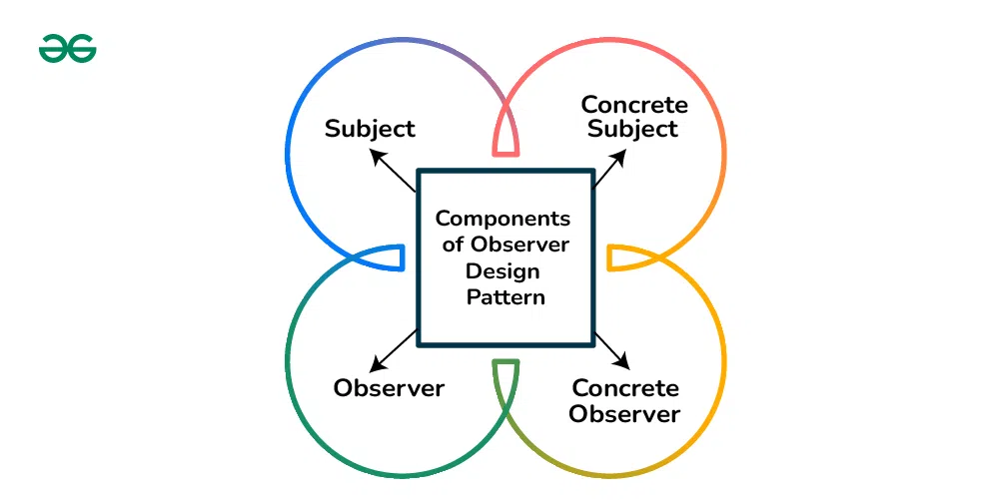
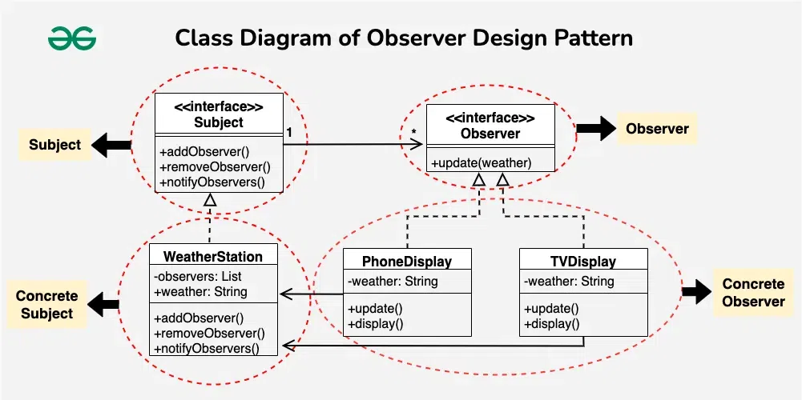

## Observer Design Pattern

The Observer Design Pattern is a behavioral design pattern that defines a one-to-many dependency between objects so that when one object (the subject) changes state, all its dependents (observers) are notified and updated automatically.

*It primarily deals with the interaction and communication between objects, specifically focusing on how objects behave in response to changes in the state of other objects.*

### Components of Observer Design Pattern


1. **Subject** : The subject maintains a list of observers (subscribers or listeners). It Provides methods to register and unregister observers dynamically and defines a method to notify observers of changes in its state.

2. **Observer** : Observer defines an interface with an update method that concrete observers must implement and ensures a common or consistent way for concrete observers to receive updates from the subject. Concrete observers implement this interface, allowing them to react to changes in the subject’s state.

3. **ConcreteSubject** : ConcreteSubjects are specific implementations of the subject. They hold the actual state or data that observers want to track. When this state changes, concrete subjects notify their observers. For instance, if a weather station is the subject, specific weather stations in different locations would be concrete subjects.

4. **ConcreteObserver** : Concrete Observer implements the observer interface. They register with a concrete subject and react when notified of a state change. When the subject’s state changes, the concrete observer’s update() method is invoked, allowing it to take appropriate actions. In a practical example, a weather app on your smartphone is a concrete observer that reacts to changes from a weather station.

#### Example
**Weather Station**


**Subject** :- 
- The “Subject" interface outlines the operations a subject (like “WeatherStation") should support.
- "addObserver" and “removeObserver" are for managing the list of observers.
- "notifyObservers" is for informing observers about changes.
```java
public interface Subject {
    void addObserver(Observer observer);
    void removeObserver(Observer observer);
    void notifyObservers();
}
```

**Observer** :- defines the contract for the objects that want to be notified about changes in the Subject
```java
public interface Observer {
    void update(String weather);
}
```

**ConcreteSubject(WeatherStation)**
```java

public class WeatherStation implements Subject {
    private List<Observer> observers = new ArrayList<>();
    private String weather;

    @Override
    public void addObserver(Observer observer) {
        observers.add(observer);
    }

    @Override
    public void removeObserver(Observer observer) {
        observers.remove(observer);
    }

    @Override
    public void notifyObservers() {
        for (Observer observer : observers) {
            observer.update(weather);
        }
    }

    public void setWeather(String newWeather) {
        this.weather = newWeather;
        notifyObservers();
    }
}
```

**ConcreteObserver**
```java
public class PhoneDisplay implements Observer {
    private String weather;

    @Override
    public void update(String weather) {
        this.weather = weather;
        display();
    }

    private void display() {
        System.out.println("Phone Display: Weather updated - " + weather);
    }
}


class TVDisplay implements Observer {
    private String weather;
 
    @Override
    public void update(String weather) {
        this.weather = weather;
        display();
    }
 
    private void display() {
        System.out.println("TV Display: Weather updated - " + weather);
    }
}

```

Usage :- 
```java
public class WeatherApp {
    public static void main(String[] args) {
        WeatherStation weatherStation = new WeatherStation();

        Observer phoneDisplay = new PhoneDisplay();
        Observer tvDisplay = new TVDisplay();

        weatherStation.addObserver(phoneDisplay);
        weatherStation.addObserver(tvDisplay);

        // Simulating weather change
        weatherStation.setWeather("Sunny");

        // Output:
        // Phone Display: Weather updated - Sunny
        // TV Display: Weather updated - Sunny
    }
}
```


When to use the Observer Design Pattern?
- **One-to-Many Dependence**:
    - Use the Observer pattern when there is a one-to-many relationship between objects, and changes in one object should notify multiple dependent objects.
    - This is particularly useful when changes in one object need to propagate to several other objects without making them tightly coupled.
- **Decoupling**:
    - Use the Observer pattern to achieve loose coupling between objects.
    - This allows the subject (publisher) and observers (subscribers) to interact without being aware of each other’s specific details. It promotes a flexible and maintainable system.
- **Change Propagation**:
    - When changes in the state of one object should automatically trigger updates in other objects, the Observer pattern is beneficial.
    - This helps ensure that all dependent objects are informed and can respond accordingly to changes in the subject.
**Dynamic Composition**:
    - If you need to support dynamic composition of objects with runtime registration and deregistration of observers, the Observer pattern is suitable.
    - New observers can be added or existing ones removed without modifying the subject.
- **Event Handling**:
    - The Observer pattern is often used in event handling systems.
    - When events occur in a system, observers (listeners) can react to those events without requiring the source of the events to have explicit knowledge of the observers.


    