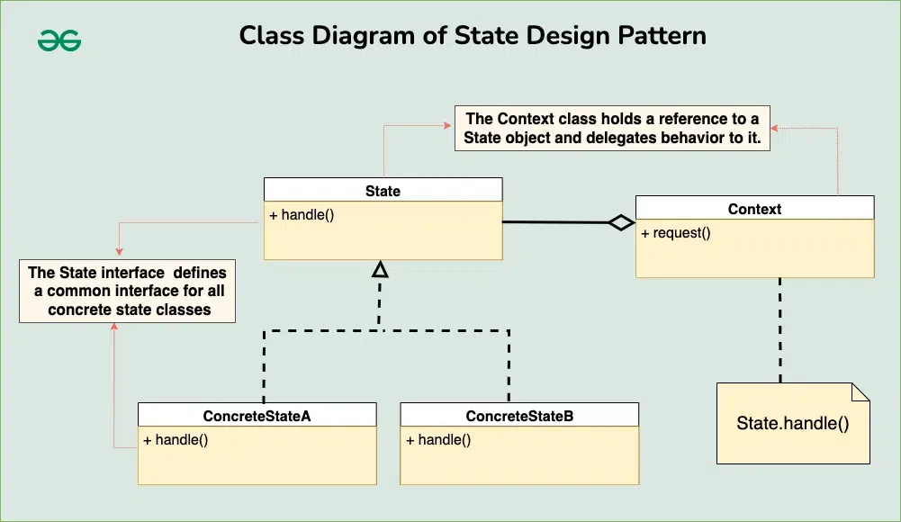

## State Design Pattern

The State Design Pattern is a behavioral design pattern that allows an object to change its behavior when its internal state changes. This pattern is particularly useful when an object’s behavior depends on its state, and the state can change during the object’s lifecycle.

***This pattern focuses on managing state transitions and coordinating state-specific behaviors.***

**Components of State Design Pattern**
1. **Context** : The Context is the class that contains the object whose behavior changes based on its internal state. It maintains a reference to the current state object that represents the current state of the Context. The Context provides an interface for clients to interact with and typically delegates state-specific behavior to the current state object.

2. **State Interface or Base Class** : The State interface or base class defines a common interface for all concrete state classes. This interface typically declares methods that represent the state-specific behavior that the Context can exhibit. It allows the Context to interact with state objects without knowing their concrete types.

3. **Concrete States** : Concrete state classes implement the State interface or extend the base class. Each concrete state class encapsulates the behavior associated with a specific state of the Context. These classes define how the Context behaves when it is in their respective states.



**Communication between the components**
In the State design pattern, the communication between the components typically follows these steps:

**Step1: Client Interaction** \
The client interacts with the Context object, either directly or indirectly, by invoking methods on it.

**Step2 :Behavior Delegation** \
When the client triggers an action or requests a behavior from the Context, the Context delegates the responsibility to its current State object.

**Step3 :State-specific Behavior Execution** \
The current State object receives the delegated request and executes the behavior associated with its particular state.

**Step4 :Possible State Transition** \
Depending on the logic implemented within the State object or controlled by the Context, a state transition may occur.

**Step5 :Update of Current State** \
If a state transition occurs, the Context updates its reference to the new State object, reflecting the change in its internal state.

**Step6 :Continued Interaction** \
The client continues to interact with the Context as needed, and the process repeats, with behavior delegation to the appropriate State object based on the current state of the Context.

*This communication flow ensures that the Context and State objects work together seamlessly to achieve dynamic behavior changes based on the internal state of the Context. The Context manages the state and delegates behavior to the current State object, while the State objects encapsulate state-specific behavior and handle transitions between states as necessary*

### Example
*Imagine a vending machine that sells various products. The vending machine needs to manage different states such as ready to serve, waiting for product selection, processing payment, and handling out-of-stock situations. Design a system that models the behavior of this vending machine efficiently.*


Context(VendingMachineContext)
```java
public class VendingMachineContext {
    private VendingMachineState state;

    public void setState(VendingMachineState state) {
        this.state = state;
    }

    public void request() {
        state.handleRequest();
    }
}
```

State Interface (VendingMachineState)
```java
public interface VendingMachineState {
    void handleRequest();
}
```

Concrete States (Specific Vending Machine States)
```java
public class ReadyState implements VendingMachineState {
    @Override
    public void handleRequest() {
        System.out.println("Ready state: Please select a product.");
    }
}

public class ProductSelectedState implements VendingMachineState {
    @Override
    public void handleRequest() {
        System.out.println("Product selected state: Processing payment.");
    }
}

public class PaymentPendingState implements VendingMachineState {
    @Override
    public void handleRequest() {
        System.out.println("Payment pending state: Dispensing product.");
    }
}

public class OutOfStockState implements VendingMachineState {
    @Override
    public void handleRequest() {
        System.out.println("Out of stock state: Product unavailable. Please select another product.");
    }
}
```

Client
```java
public class Main {
    public static void main(String[] args) {
        // Create context
        VendingMachineContext vendingMachine = new VendingMachineContext();

        // Set initial state
        vendingMachine.setState(new ReadyState());

        // Request state change
        vendingMachine.request();

        // Change state
        vendingMachine.setState(new ProductSelectedState());

        // Request state change
        vendingMachine.request();

        // Change state
        vendingMachine.setState(new PaymentPendingState());

        // Request state change
        vendingMachine.request();

        // Change state
        vendingMachine.setState(new OutOfStockState());

        // Request state change
        vendingMachine.request();
    }
}
```

Output
```
Ready state: Please select a product.
Product selected state: Processing payment.
Payment pending state: Dispensing product.
Out of stock state: Product unavailable. Please select another product.
```

