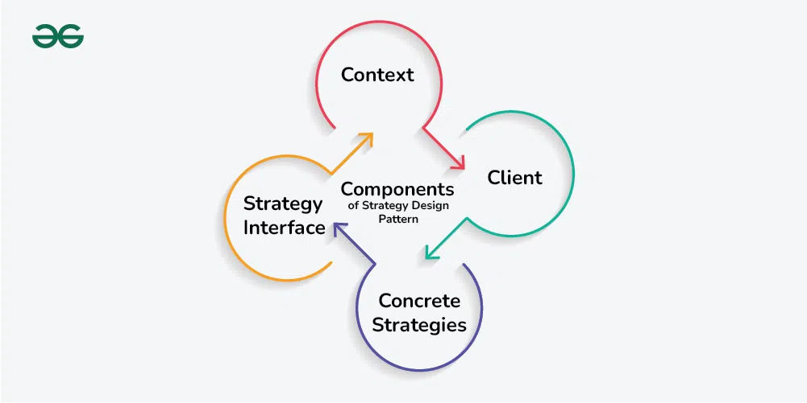
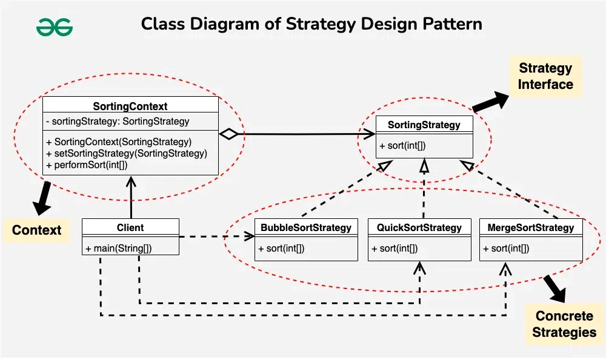

## Strategy Design Pattern

The Strategy Design Pattern defines a family of algorithms, encapsulates each one, and makes them interchangeable, allowing clients to switch algorithms dynamically without altering the code structure.

### Components of the Strategy Design Pattern


1. **Context**
The Context is a class or object that holds a reference to a strategy object and delegates the task to it.

    - It acts as the interface between the client and the strategy, providing a unified way to execute the task without knowing the details of how it’s done.
    - The Context maintains a reference to a strategy object and calls its methods to perform the task, allowing for interchangeable strategies to be used.
2. **Strategy Interface**
The Strategy Interface is an interface or abstract class that defines a set of methods that all concrete strategies must implement.

    - It serves as a contract, ensuring that all strategies adhere to the same set of rules and can be used interchangeably by the Context.
    - By defining a common interface, the Strategy Interface allows for decoupling between the Context and the concrete strategies, promoting flexibility and modularity in the design.
3. **Concrete Strategies**
Concrete Strategies are the various implementations of the Strategy Interface. Each concrete strategy provides a specific algorithm or behavior for performing the task defined by the Strategy Interface.

    - Concrete strategies encapsulate the details of their respective algorithms and provide a method for executing the task.
    - They are interchangeable and can be selected and configured by the client based on the requirements of the task.
4. **Client**
The Client is responsible for selecting and configuring the appropriate strategy and providing it to the Context.

    - It knows the requirements of the task and decides which strategy to use based on those requirements.
    - The client creates an instance of the desired concrete strategy and passes it to the Context, enabling the Context to use the selected strategy to perform the task.

#### Real-World Analogy of Strategy Design Pattern
Imagine you’re planning a trip to a new city, and you have several options for getting there: by car, by train, or by plane. Each mode of transportation offers its own set of advantages and disadvantages, depending on factors such as cost, travel time, and convenience.

- **Context**: You, as the traveler, represent the context in this analogy. You have a specific goal (reaching the new city) and need to choose the best transportation strategy to achieve it.
- **Strategies**: The different modes of transportation (car, train, plane) represent the strategies in this analogy. Each strategy (mode of transportation) offers a different approach to reaching your destination.
- **Interface**:
    - The interface in this analogy is the set of common criteria you consider when choosing a transportation mode, such as cost, travel time, and convenience.
    - These criteria serve as the common interface that all strategies must adhere to.
- **Flexibility**:
    - Just as the Strategy Design Pattern allows you to dynamically switch between different algorithms at runtime, you have the flexibility to choose a transportation mode based on your specific requirements and constraints.
    - For example, if you value speed and are willing to pay more, you might choose to fly.
    - If you prioritize cost-effectiveness and don’t mind a longer travel time, you might opt for a train or car.
- **Dynamic Selection**:
    - The Strategy Design Pattern allows you to dynamically select the best strategy (transportation mode) based on changing circumstances.
    - For instance, if your initial flight is canceled due to bad weather, you can quickly switch to an alternative mode of transportation, such as taking a train or renting a car, without having to change your overall travel plans drastically.


#### Example
**Sorting**


Context(SortingContext)
```java
public class SortingContext {
    private SortingStrategy sortingStrategy;
 
    public SortingContext(SortingStrategy sortingStrategy) {
        this.sortingStrategy = sortingStrategy;
    }
 
    public void setSortingStrategy(SortingStrategy sortingStrategy) {
        this.sortingStrategy = sortingStrategy;
    }
 
    public void performSort(int[] array) {
        sortingStrategy.sort(array);
    }
}
```
Strategy Interface(SortingStrategy)
```java
public interface SortingStrategy {
    void sort(int[] array);
}
```

Concrete Strategies
```java
// BubbleSortStrategy
public class BubbleSortStrategy implements SortingStrategy {
	@Override
	public void sort(int[] array) {
		// Implement Bubble Sort algorithm
		System.out.println("Sorting using Bubble Sort");
	}
}

// MergeSortStrategy
public class MergeSortStrategy implements SortingStrategy {
	@Override
	public void sort(int[] array) {
		// Implement Merge Sort algorithm
		System.out.println("Sorting using Merge Sort");
	}
}

// QuickSortStrategy
public class QuickSortStrategy implements SortingStrategy {
	@Override
	public void sort(int[] array) {
		// Implement Quick Sort algorithm
		System.out.println("Sorting using Quick Sort");
	}
}

```
Client Component
```java
public class Client {
	public static void main(String[] args) {
		// Create SortingContext with BubbleSortStrategy
		SortingContext sortingContext = new SortingContext(new BubbleSortStrategy());
		int[] array1 = {5, 2, 9, 1, 5};
		sortingContext.performSort(array1); // Output: Sorting using Bubble Sort

		// Change strategy to MergeSortStrategy
		sortingContext.setSortingStrategy(new MergeSortStrategy());
		int[] array2 = {8, 3, 7, 4, 2};
		sortingContext.performSort(array2); // Output: Sorting using Merge Sort

		// Change strategy to QuickSortStrategy
		sortingContext.setSortingStrategy(new QuickSortStrategy());
		int[] array3 = {6, 1, 3, 9, 5};
		sortingContext.performSort(array3); // Output: Sorting using Quick Sort
	}
}
```

Output
```
Sorting using Bubble Sort
Sorting using Merge Sort
Sorting using Quick Sort
```


