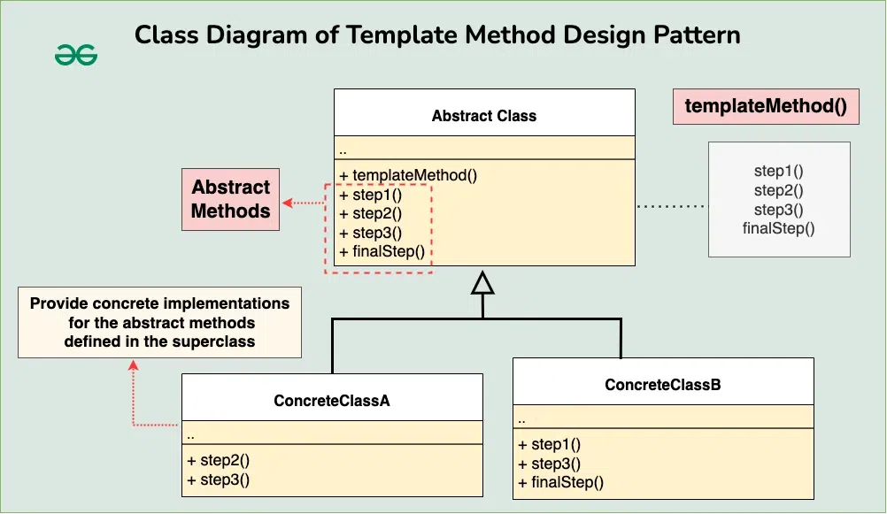

## Template Method Design Pattern

The Template Method design pattern is a behavioral design pattern that defines the skeleton of an algorithm in a superclass but allows subclasses to override specific steps of the algorithm without changing its structure.

***To be used when we want all the classes to follow specific Steps to Process the task but also need to provide the flexibility that each class can have their own logic for specific step***



### Example

#### Beverage Maker
***Let’s consider a scenario where we have a process for making different types of beverages, such as tea and coffee. While the overall process of making beverages is similar (e.g., boiling water, adding ingredients), the specific steps and ingredients vary for each type of beverage.***


Abstract Class
```java
// Abstract class defining the template method
abstract class BeverageMaker {
	// Template method defining the overall process
	public final void makeBeverage() {
		boilWater();
		brew();
		pourInCup();
		addCondiments();
	}

	// Abstract methods to be implemented by subclasses
	abstract void brew();
	abstract void addCondiments();

	// Common methods
	void boilWater() {
		System.out.println("Boiling water");
	}

	void pourInCup() {
		System.out.println("Pouring into cup");
	}
}
```

Concrete Classes
```java
class TeaMaker extends BeverageMaker {
    // Implementing abstract methods
    @Override
    void brew() {
        System.out.println("Steeping the tea");
    }
 
    @Override
    void addCondiments() {
        System.out.println("Adding lemon");
    }
}


class CoffeeMaker extends BeverageMaker {
    // Implementing abstract methods
    @Override
    void brew() {
        System.out.println("Dripping coffee through filter");
    }
 
    @Override
    void addCondiments() {
        System.out.println("Adding sugar and milk");
    }
}
```

Client
```java

public class Main {
    public static void main(String[] args) {
        System.out.println("Making tea:");
        BeverageMaker teaMaker = new TeaMaker();
        teaMaker.makeBeverage();
 
        System.out.println("\nMaking coffee:");
        BeverageMaker coffeeMaker = new CoffeeMaker();
        coffeeMaker.makeBeverage();
    }
}
```

Output
```
Making tea:
Boiling water
Steeping the tea
Pouring into cup
Adding lemon

Making coffee:
Boiling water
Dripping coffee through filter
Pouring into cup
Adding sugar and milk

```

#### Different Payment Modes
Abstract Class

```java
public abstract class PaymentFlow {
	public abstract void validateRequest();
	public abstract void calculateFees();
	public abstract void debit Amount();
	public abstract void credit Amount();
	
	//this is Template method: which defines the order of steps to execute the task.
	public final void send Money() {
		//step1
		validateRequest();
		//step2
		debit Amount();
		//step3
		calculate Fees();
		//step4
		creditAmount();
	}
}
```

Concrete Classes

```java
public class PayToFriend extends PaymentFlow{
	@Override
	public void validateRequest() {
		//specific validation for PayToFriend flow
		System.out.println("Validate logic of PayToFriend");
	}
	@Override
	public void debit Amount () {
		//debit the amount
		System.out.println("Debit the Amount logic of PayToFriend");
	}
	@Override
	public void calculate Fees () {
		//specific Fee computation logic for PayToFriend flow
		System.out.println("0% fees charged");
	}
	@Override
	public void creditAmount() {
		// credit the amount logic
		System.out.println("Credit the full amount");
	}
}

public class PayToMerchant Flow extends PaymentFlow{
	@Override
	public void validateRequest() {
		//specific validation for PayToFriend flow
		System.out.println("Validate logic of PayToMerchant Flow");
	}
	@Override
	public void debit Amount () {
		//debit the amount
		System.out.println("Debit the Amount logic of PayToMerchantFlow");
	}
	@Override
	public void calculate Fees () {
		//specific Fee computation logic for PayToFriend flow
		System.out.println("2% fees charged");
	}
	@Override
	public void credit Amount () {
		// credit the amount logic
		System.out.println("Credit the remaining amount");	
	}
}
```

Client
```java
PaymentFlow obj = new PayToFriend();
obj .sendMoney();
```
