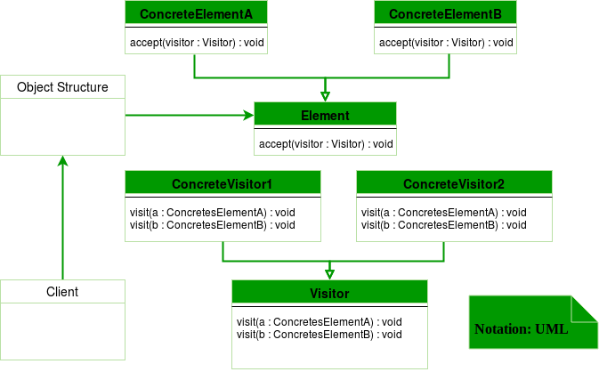

## Visitor design pattern
Visitor design pattern is one of the behavioral design patterns. It is used when we have to perform an operation on a group of similar kind of Objects. With the help of visitor pattern, we can move the operational logic from the objects to another class. The visitor pattern consists of two parts:

- a method called `visit()` which is implemented by the visitor and is called for every element in the data structure
- visitable classes providing `accept()` methods that accept a visitor



**Design components**

- **Client** : The Client class is a consumer of the classes of the visitor design pattern. It has access to the data structure objects and can instruct them to accept a Visitor to perform the appropriate processing.
- **Visitor** : This is an interface or an abstract class used to declare the visit operations for all the types of visitable classes.
- **ConcreteVisitor** : For each type of visitor all the visit methods, declared in abstract visitor, must be implemented. Each Visitor will be responsible for different operations.
- **Visitable** : This is an interface which declares the accept operation. This is the entry point which enables an object to be “visited” by the visitor object.
- **ConcreteVisitable** : These classes implement the Visitable interface or class and defines the accept operation. The visitor object is passed to this object using the accept operation.

### Example
#### Shopping Cart

```java
interface ItemElement
{
	public int accept(ShoppingCartVisitor visitor);
}

class Book implements ItemElement
{
	private int price;
	private String isbnNumber;

	public Book(int cost, String isbn)
	{
		this.price=cost;
		this.isbnNumber=isbn;
	}

	public int getPrice() 
	{
		return price;
	}

	public String getIsbnNumber() 
	{
		return isbnNumber;
	}

	@Override
	public int accept(ShoppingCartVisitor visitor) 
	{
		return visitor.visit(this);
	}

}

class Fruit implements ItemElement 
{
	private int pricePerKg;
	private int weight;
	private String name;

	public Fruit(int priceKg, int wt, String nm)
	{
		this.pricePerKg=priceKg;
		this.weight=wt;
		this.name = nm;
	}

	public int getPricePerKg() 
	{
		return pricePerKg;
	}

	public int getWeight() 
	{
		return weight;
	}

	public String getName()
	{
		return this.name;
	}

	@Override
	public int accept(ShoppingCartVisitor visitor) 
	{
		return visitor.visit(this);
	}

}

interface ShoppingCartVisitor 
{

	int visit(Book book);
	int visit(Fruit fruit);
}

class ShoppingCartVisitorImpl implements ShoppingCartVisitor
{

	@Override
	public int visit(Book book)
	{
		int cost=0;
		//apply 5$ discount if book price is greater than 50
		if(book.getPrice() > 50)
		{
			cost = book.getPrice()-5;
		}
		else
			cost = book.getPrice();
			
		System.out.println("Book ISBN::"+book.getIsbnNumber() + " cost ="+cost);
		return cost;
	}

	@Override
	public int visit(Fruit fruit) 
	{
		int cost = fruit.getPricePerKg()*fruit.getWeight();
		System.out.println(fruit.getName() + " cost = "+cost);
		return cost;
	}

}

class ShoppingCartClient 
{

	public static void main(String[] args) 
	{
		ItemElement[] items = new ItemElement[]{new Book(20, "1234"),
							new Book(100, "5678"), new Fruit(10, 2, "Banana"),
							new Fruit(5, 5, "Apple")};

		int total = calculatePrice(items);
		System.out.println("Total Cost = "+total);
	}

	private static int calculatePrice(ItemElement[] items) 
	{
		ShoppingCartVisitor visitor = new ShoppingCartVisitorImpl();
		int sum=0;
		for(ItemElement item : items)
		{
			sum = sum + item.accept(visitor);
		}
		return sum;
	}

}

```

#### Hotel Room Maintenance
##### Bad Code
```java
public class HotelRoom {
   public void getRoomPrice(){
       // price computation logic
   }

   public void initiateRoomMaintenance(){
       // start room maintenance
   }

   public void reserveRoom(){
       // perform operation to reserve the room
   }

   // many more operations can come over the time
}
```
Addition of Operations to Hotel Room Class will affect the class and every time the class will be required to be tested

##### Using Visitor Pattern

RoomElement Interface
```java
public interface RoomElement {
    public void accept(RoomVisitor visitor);
}
```

Concrete RoomElement classes
```java
public class SingleRoom implements RoomElement {
    public int roomPrice = 0;
    
    @Override
    public void accept(RoomVisitor visitor) {
        visitor.visit(this);
    }
}

public class DoubleRoom implements RoomElement {
    public int roomPrice = 0;
    
    @Override
    public void accept(RoomVisitor visitor) {
        visitor.visit(this);
    }
}

public class DeluxeRoom implements RoomElement {
    public int roomPrice = 0;
    
    @Override
    public void accept(RoomVisitor visitor) {
        visitor.visit(this);
    }
}

```

RoomVisitor Interface
```java
public interface RoomVisitor {
    public void visit(SingleRoom singleRoomObj);
    public void visit(DoubleRoom doubleRoomObj);
    public void visit(DeluxeRoom deluxeRoomObj);
}

```

Concrete RoomVisitor 
```java
public class RoomPricingVisitor implements RoomVisitor {
    @Override
    public void visit(SingleRoom singleRoomObj) {
        System.out.println("Pricing computation logic of SingleRoom");
        singleRoomObj.roomPrice = 1000;
    }
    
    @Override
    public void visit(DoubleRoom doubleRoomObj) {
        System.out.println("Pricing computation logic of DoubleRoom");
        doubleRoomObj.roomPrice = 2000;
    }
    
    @Override
    public void visit(DeluxeRoom deluxeRoomObj) {
        System.out.println("Pricing computation logic of DeluxeRoom");
        deluxeRoomObj.roomPrice = 5000;
    }
}


public class RoomMaintenanceVisitor implements RoomVisitor {
    @Override
    public void visit(SingleRoom singleRoomObj) {
        System.out.println("Performing maintenance of SingleRoom");
    }
    
    @Override
    public void visit(DoubleRoom doubleRoomObj) {
        System.out.println("Performing maintenance of DoubleRoom");
    }
    
    @Override
    public void visit(DeluxeRoom deluxeRoomObj) {
        System.out.println("Performing maintenance of DeluxeRoom");
    }
}


```

Client class
```java
public class Client {
    public static void main(String args[]){
        RoomElement singleRoomObj = new SingleRoom();
        RoomElement doubleRoomObj = new DoubleRoom();
        RoomElement deluxeRoomObj = new DeluxeRoom();
        
        // Performing an operation on the objects
        RoomVisitor pricingVisitorObj = new RoomPricingVisitor();
        singleRoomObj.accept(pricingVisitorObj);
        System.out.println(singleRoomObj.roomPrice);
        
        doubleRoomObj.accept(pricingVisitorObj);
        System.out.println(doubleRoomObj.roomPrice);
        
        deluxeRoomObj.accept(pricingVisitorObj);
        System.out.println(deluxeRoomObj.roomPrice);
        
        // Performing another operation on the objects
        RoomVisitor maintenanceVisitorObj = new RoomMaintenanceVisitor();
        singleRoomObj.accept(maintenanceVisitorObj);
        doubleRoomObj.accept(maintenanceVisitorObj);
        deluxeRoomObj.accept(maintenanceVisitorObj);
    }
}

```

