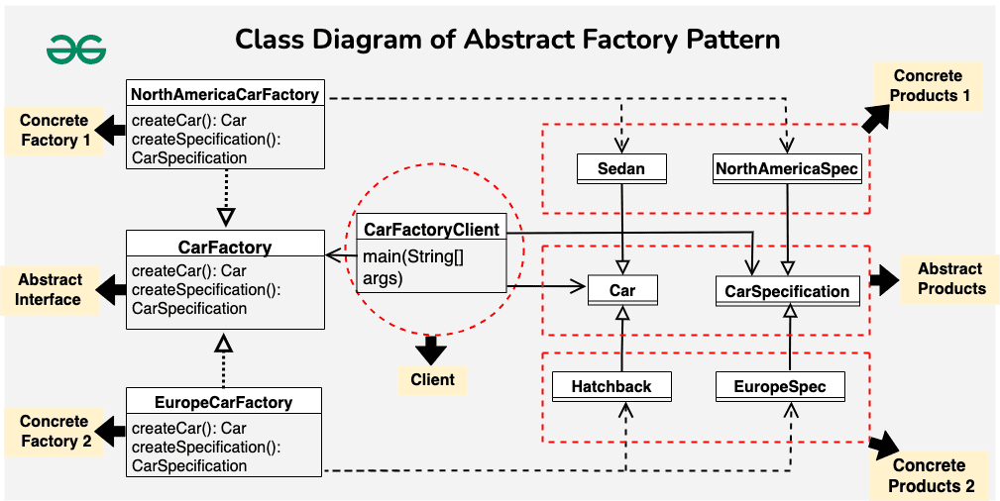

## Abstract Factory Pattern

The Abstract Factory Pattern is a creational design pattern that provides an interface for creating families of related or dependent objects without specifying their concrete classes, in simpler terms the Abstract Factory Pattern is a way of organizing how you create groups of things that are related to each other.

**Components of Abstract Factory Pattern**
1. **Abstract Factory** - Abstract Factory serves as a high-level blueprint that defines a set of rules for creating families of related objects without specifying their concrete classes. It declares a series of methods, each responsible for creating a particular type of object and ensures that concrete factories adhere to a common interface, providing a consistent way to produce related sets of objects.

2. **Concrete Factories** - Concrete Factories implement the rules specified by the abstract factory. It contain the logic for creating specific instances of objects within a family. Also multiple concrete factories can exist, each tailored to produce a distinct family of related objects.

3. **Abstract Products** - Abstract Products represents a family of related objects by defining a set of common methods or properties. It acts as an abstract or interface type that all concrete products within a family must adhere to and provides a unified way for concrete products to be used interchangeably.

4. **Concrete Products** - They are the actual instances of objects created by concrete factories. They implement the methods declared in the abstract products, ensuring consistency within a family and belong to a specific category or family of related objects.

5. **Client** - Client utilizes the abstract factory to create families of objects without specifying their concrete types and interacts with objects through abstract interfaces provided by abstract products. Client enjoys the flexibility of seamlessly switching between families of objects by changing the concrete factory instance.



Abstract Factory
```java
interface CarFactory {
    Car createCar();
    CarSpecification createSpecification();
}
```

Concrete Factory
```java
class NorthAmericaCarFactory implements CarFactory {
    public Car createCar() {
        return new Sedan();
    }

    public CarSpecification createSpecification() {
        return new NorthAmericaSpecification();
    }
}

// Concrete Factory for Europe Cars
class EuropeCarFactory implements CarFactory {
    public Car createCar() {
        return new Hatchback();
    }

    public CarSpecification createSpecification() {
        return new EuropeSpecification();
    }
}
```

Abstract Product
```java
interface Car {
    void assemble();
}

interface CarSpecification {
    void display();
}
```

Concrete Products
```java
class Sedan implements Car {
    public void assemble() {
        System.out.println("Assembling Sedan car.");
    }
}

class Hatchback implements Car {
    public void assemble() {
        System.out.println("Assembling Hatchback car.");
    }
}

class NorthAmericaSpecification implements CarSpecification {
    public void display() {
        System.out.println("North America Car Specification: Safety features compliant with local regulations.");
    }
}

class EuropeSpecification implements CarSpecification {
    public void display() {
        System.out.println("Europe Car Specification: Fuel efficiency and emissions compliant with EU standards.");
    }
}
```

Client Code
```java
// Client Code
public class CarFactoryClient {
    public static void main(String[] args) {
        // Creating cars for North America
        CarFactory northAmericaFactory = new NorthAmericaCarFactory();
        Car northAmericaCar = northAmericaFactory.createCar();
        CarSpecification northAmericaSpec = northAmericaFactory.createSpecification();

        northAmericaCar.assemble();
        northAmericaSpec.display();

        // Creating cars for Europe
        CarFactory europeFactory = new EuropeCarFactory();
        Car europeCar = europeFactory.createCar();
        CarSpecification europeSpec = europeFactory.createSpecification();

        europeCar.assemble();
        europeSpec.display();
    }
}
```

Output
```
Assembling Sedan car.
North America Car Specification: Safety features compliant with local regulations.
Assembling Hatchback car.
Europe Car Specification: Fuel efficiency and emissions compliant with EU standards.
```