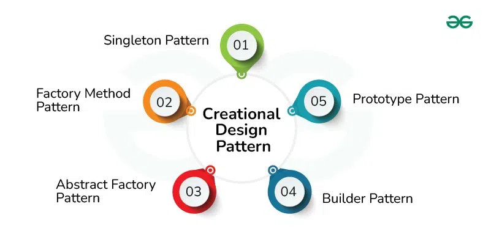

## Creational Design Patterns
*Creational Design Pattern abstract the instantiation process. They help in making a system independent of how its objects are created, composed and represented.*

1. **Factory Pattern** - The Factory Method pattern is used to create objects without specifying the exact class of object that will be created. This pattern is useful when you need to decouple the creation of an object from its implementation.
1. **Abstract Factory Pattern**  - Abstract Factory pattern is almost similar to Factory Pattern and is considered as another layer of abstraction over factory pattern. Abstract Factory patterns work around a super-factory which creates other factories.
1. **Singleton Pattern** - The Singleton method or Singleton Design pattern is one of the simplest design patterns. It ensures a class only has one instance, and provides a global point of access to it.
1. **Builder Pattern** - Builder pattern aims to “Separate the construction of a complex object from its representation so that the same construction process can create different representations.” It is used to construct a complex object step by step and the final step will return the object.
1. **Prototype Pattern** - Prototype allows us to hide the complexity of making new instances from the client. The concept is to copy an existing object rather than creating a new instance from scratch, something that may include costly operations. The existing object acts as a prototype and contains the state of the object.
