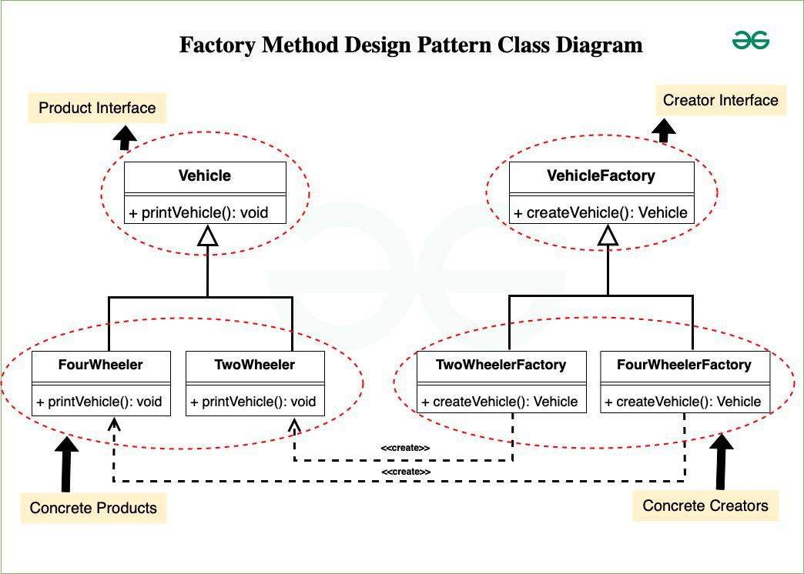

## Factory Design Pattern

It encapsulates object creation logic in a separate method, promoting loose coupling between the creator and the created objects. This pattern is particularly useful when the exact types of objects to be created may vary or need to be determined at runtime, enabling flexibility and extensibility in object creation.

**Advantages of the Factory Method Pattern**
- **Single Responsibility Principle**: Factory methods eliminate the need to bind application-specific classes into your code. The code deals with interfaces, so it can work with any user-defined classes that implement these interfaces.
- **Open/Closed Principle**: The factory method allows the addition of new products without changing the creator's code.
- **Flexibility**: Factory methods provide flexibility in deciding the type of objects to create. This is useful when the exact type of object is not known until runtime.

**Components of Factory Method Design Pattern**
1. **Creator** :- 
This is an abstract class or an interface that declares the factory method. The creator typically contains a method that serves as a factory for creating objects. It may also contain other methods that work with the created objects.

2. **Concrete Creator** :- 
Concrete Creator classes are subclasses of the Creator that implement the factory method to create specific types of objects. Each Concrete Creator is responsible for creating a particular product.

3. **Product** :- 
This is the interface or abstract class for the objects that the factory method creates. The Product defines the common interface for all objects that the factory method can create.

4. **Concrete Product** :-
Concrete Product classes are the actual objects that the factory method creates. Each Concrete Product class implements the Product interface or extends the Product abstract class.



Product Interface
```java
public abstract class Vehicle {
    public abstract void printVehicle();
}
```

Concrete Products
```java
public class TwoWheeler extends Vehicle {
    public void printVehicle() {
        System.out.println("I am two wheeler");
    }
}

public class FourWheeler extends Vehicle {
    public void printVehicle() {
        System.out.println("I am four wheeler");
    }
}
```

Creator Interface (Factory Interface)
```java
public interface VehicleFactory {
    Vehicle createVehicle();
}
```

Concrete Creators (Concrete Factories)
```java
public class TwoWheelerFactory implements VehicleFactory {
    public Vehicle createVehicle() {
        return new TwoWheeler();
    }
}

public class FourWheelerFactory implements VehicleFactory {
    public Vehicle createVehicle() {
        return new FourWheeler();
    }
}
```

Client Class
```java
class Client {
    private Vehicle pVehicle;

    public Client(VehicleFactory factory) {
        pVehicle = factory.createVehicle();
    }

    public Vehicle getVehicle() {
        return pVehicle;
    }
}
```
Test Program
```java
public class TestProgram {
    public static void main(String[] args) {
        VehicleFactory twoWheelerFactory = new TwoWheelerFactory();
        Client twoWheelerClient = new Client(twoWheelerFactory);
        Vehicle twoWheeler = twoWheelerClient.getVehicle();
        twoWheeler.printVehicle();

        VehicleFactory fourWheelerFactory = new FourWheelerFactory();
        Client fourWheelerClient = new Client(fourWheelerFactory);
        Vehicle fourWheeler = fourWheelerClient.getVehicle();
        fourWheeler.printVehicle();
    }
}
```