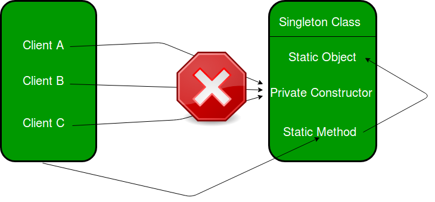
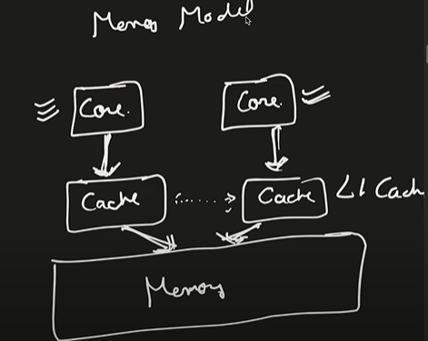

## Singleton Design Pattern

*The Singleton method or Singleton Design pattern is one of the simplest design patterns. It ensures a class only has one instance, and provides a global point of access to it.*



**Key Concepts**

- **Single Instance**: Ensures that a class has only one instance.
- **Global Access Point**: Provides a global access point to that instance.
- **Lazy Initialization**: The instance is created only when it is needed for the first time.
- **Thread Safety**: Ensures that the instance is created safely when accessed by multiple threads.

**Structure**
- **Private Constructor**: Prevents the instantiation of the class from outside.
- **Static Variable**: Holds the single instance of the class.
- **Public Static Method**: Provides global access to the instance.

### Example - Logger 
```java
public class Logger {
    // The single instance of the Logger
    private static Logger instance;

    // Private constructor to prevent instantiation
    private Logger() {
    }

    // Public method to provide access to the instance
    public static Logger getInstance() {
        if (instance == null) {
            instance = new Logger();
        }
        return instance;
    }

    // Example method to log a message
    public void log(String message) {
        System.out.println("Log message: " + message);
    }
}


public class SingletonPatternDemo {
    public static void main(String[] args) {
        // Get the single instance of Logger
        Logger logger = Logger.getInstance();

        // Use the logger to log messages
        logger.log("This is the first log message.");
        logger.log("This is the second log message.");
    }
}
```

#### Thread Safe Singleton
To ensure that the Singleton instance is created safely when accessed by multiple threads, you can use synchronized methods or other thread-safe mechanisms.

```java
public class ThreadSafeLogger {
    private static ThreadSafeLogger instance;

    private ThreadSafeLogger() {
    }

    public static synchronized ThreadSafeLogger getInstance() {
        if (instance == null) {
            instance = new ThreadSafeLogger();
        }
        return instance;
    }

    public void log(String message) {
        System.out.println("Log message: " + message);
    }
}
```

#### Double-Checked Locking
Double-checked locking can be used to reduce the overhead of synchronized methods by only locking the critical section of the code.

```java
public class DoubleCheckedLockingLogger {
    private static volatile DoubleCheckedLockingLogger instance;

    private DoubleCheckedLockingLogger() {
    }

    public static DoubleCheckedLockingLogger getInstance() {
        if (instance == null) {
            synchronized (DoubleCheckedLockingLogger.class) {
                if (instance == null) {
                    instance = new DoubleCheckedLockingLogger();
                }
            }
        }
        return instance;
    }

    public void log(String message) {
        System.out.println("Log message: " + message);
    }
}
```

### Bug/Issue with DoubleLocking


```java
public class DBConnection {
    private static DBConnection conObj;
    int memberVariableValue;
    private DBConnection(int memberVariableValue) {
        this.memberVariableValue = memberVariableValue;
    }

    public static DBConnection getInstance() {
        if (conObj == null) {
            synchronized (DBConnection.class) {
                if (conObj == null) {
                    conObj = new DBConnection(10);
                }
            }
        }
        return conObj;
    }
}
```

#### Issue 1 : Re-ordering of Instruction

Instructions to create object
1. Allocate Memory
2. Initialise all the member variables
3. Assign reference of memory to `conObj`

CPU can re-order above steps to increase performance
1. Allocate Memory
2. Assign reference of memory to `conObj`
3. Initialise all the member variables

Because of the reference getting allocated first there are chances of some thread hitting the lock check and returning with the reference of the object which still doesn't has the initialized value of member variable

#### Issue 2 : L1 Caching


Core does the computation and stores the output in L1 Cache which sync-up in between other L1 Caches and also with the memory after sometime

While the sync-up has not yet completed and is still in L1 Cache of Core 1, other thread comes in and hits Core 2 and will end-up creating another object

#### Use volatile to fix the above issues

```java
    private static volatile DBConnection conObj;
```
volatile has two properties
1. It reads/write from/to memory not from cache
2. CPU would not re-order the sequence of operations for volatile objects, whenever the volatile operation is to be performed all the previous instructions are dumped into the memory

