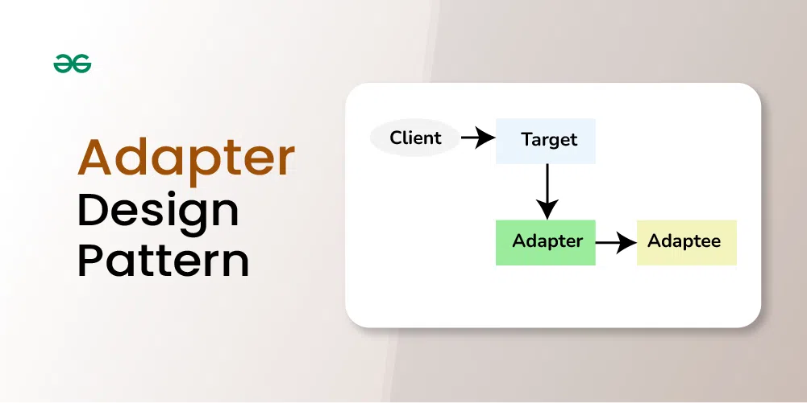

## Adapter Design Pattern

The Adapter design pattern is a structural pattern that allows the interface of an existing class to be used as another interface. It acts as a bridge between two incompatible interfaces, making them work together. This pattern involves a single class, known as the adapter, which is responsible for joining functionalities of independent or incompatible interfaces.

Let’s say you have two friends, one who speaks only English and another who speaks only French. You want them to communicate, but there’s a language barrier.

- You act as an adapter, translating messages between them. Your role allows the English speaker to convey messages to you, and you convert those messages into French for the other person.
- In this way, despite the language difference, your adaptation enables smooth communication between your friends.
- This role you play is similar to the Adapter design pattern, bridging the gap between incompatible interfaces.

Example :- Weighing Machine Conversion from Pound to Kg

