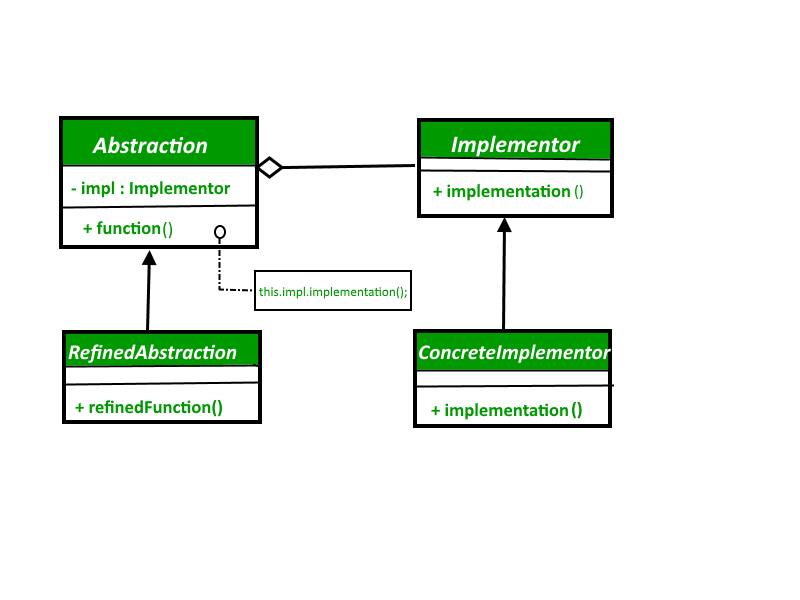
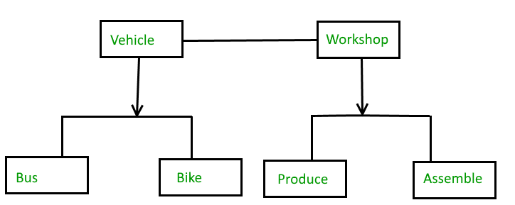

## Bridge Design Pattern
The Bridge design pattern allows you to separate the abstraction from the implementation. It is a structural design pattern. 

There are 2 parts in Bridge design pattern : 
1. Abstraction
2. Implementation

This is a design mechanism that encapsulates an implementation class inside of an interface class.  

- The bridge pattern allows the Abstraction and the Implementation to be developed independently and the client code can access only the Abstraction part without being concerned about the Implementation part.
- The abstraction is an interface or abstract class and the implementer is also an interface or abstract class.
- The abstraction contains a reference to the implementer. Children of the abstraction are referred to as refined abstractions, and children of the implementer are concrete implementers. Since we can change the reference to the implementer in the abstraction, we are able to change the abstraction’s implementer at run-time. Changes to the implementer do not affect client code.
- It increases the loose coupling between class abstraction and it’s implementation.



### Without Bridge Pattern


**Problem**:\
If you want to change the Bus class, then you may end up changing ProduceBus and AssembleBus as well and if the change is workshop specific then you may need to change the Bike class as well.

### With Bridge Pattern


abstraction in bridge pattern
```java
abstract class Vehicle {
	protected Workshop workShop1;
	protected Workshop workShop2;

	protected Vehicle(Workshop workShop1, Workshop workShop2)
	{
		this.workShop1 = workShop1;
		this.workShop2 = workShop2;
	}

	abstract public void manufacture();
}
```

Define abstraction 1 in bridge pattern
```java
class Car extends Vehicle {
	public Car(Workshop workShop1, Workshop workShop2)
	{
		super(workShop1, workShop2);
	}

	@Override
	public void manufacture()
	{
		System.out.print("Car ");
		workShop1.work();
		workShop2.work();
	}
}
```
Define abstraction 2 in bridge pattern
```java
class Bike extends Vehicle {
	public Bike(Workshop workShop1, Workshop workShop2)
	{
		super(workShop1, workShop2);
	}

	@Override
	public void manufacture()
	{
		System.out.print("Bike ");
		workShop1.work();
		workShop2.work();
	}
}
```
Implementer for bridge pattern
```java
interface Workshop
{
	abstract public void work();
}
```
Concrete implementation 1 for bridge pattern
```java
class Produce implements Workshop {
	@Override
	public void work()
	{
		System.out.print("Produced");
	}
}
```
Concrete implementation 2 for bridge pattern
```java
class Assemble implements Workshop {
	@Override
	public void work()
	{
		System.out.print(" And");
		System.out.println(" Assembled.");
	}
}
```

Demonstration of bridge design pattern
```java
class BridgePattern {
	public static void main(String[] args)
	{
		Vehicle vehicle1 = new Car(new Produce(), new Assemble());
		vehicle1.manufacture();
		Vehicle vehicle2 = new Bike(new Produce(), new Assemble());
		vehicle2.manufacture();
	}
}
```


