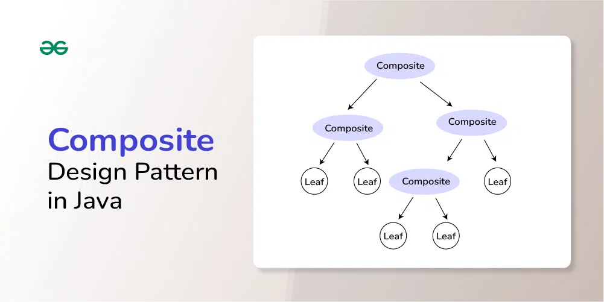
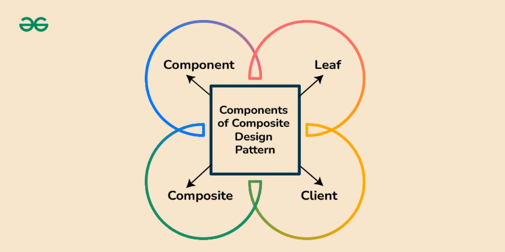
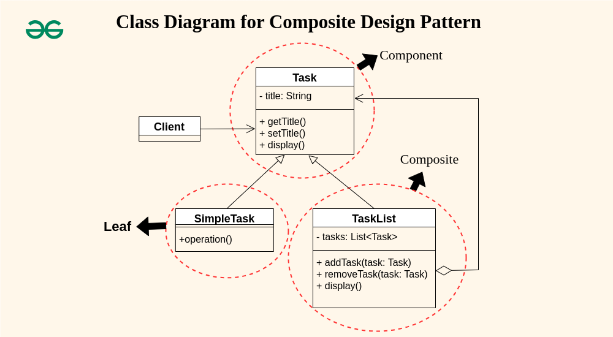

## Composite Design Pattern

The Composite Design Pattern is a structural design pattern that lets you compose objects into tree-like structures to represent part-whole hierarchies. It allows clients to treat individual objects and compositions of objects uniformly. In other words, whether dealing with a single object or a group of objects (composite), clients can use them interchangeably.

**It is useful to design when classes when tree like structures are to maintained**




#### Components of Composite Design Pattern

1. **Component** The component declares the interface for objects in the composition and for accessing and managing its child components. This is like a blueprint that tells us what both individual items (leaves) and groups of items (composites) should be able to do. It lists the things they all have in common.

2. **Leaf** Leaf defines behavior for primitive objects in the composition. This is the basic building block of the composition, representing individual objects that don’t have any child components. Leaf elements implement the operations defined by the Component interface.

3. **Composite** Composite stores child components and implements child-related operations in the component interface. This is a class that has child components, which can be either leaf elements or other composites. A composite class implements the methods declared in the Component interface, often by delegating the operations to its child components.

4. **Client** The client manipulates the objects in the composition through the component interface. The client uses the component class interface to interact with objects in the composition structure. If the recipient is a leaf then the request is handled directly. If the recipient is a composite, then it usually forwards the request to its child components, possibly performing additional operations before and after forwarding.

### Example
**project management system where tasks can be either simple tasks or a collection of tasks (subtasks) forming a larger task.**



Task (Component)
```java

public interface Task {
	String getTitle();
	void setTitle(String title);
	void display();
}
```
SimpleTask (Leaf)
```java
public class SimpleTask implements Task {
    private String title;
 
    public SimpleTask(String title) {
        this.title = title;
    }
 
    @Override
    public String getTitle() {
        return title;
    }
 
    @Override
    public void setTitle(String title) {
        this.title = title;
    }
 
    @Override
    public void display() {
        System.out.println("Simple Task: " + title);
    }
}
```
TaskList (Composite)
```java
import java.util.ArrayList;
import java.util.List;

public class TaskList implements Task {
    private String title;
    private List<Task> tasks;
 
    public TaskList(String title) {
        this.title = title;
        this.tasks = new ArrayList<>();
    }
 
    @Override
    public String getTitle() {
        return title;
    }
 
    @Override
    public void setTitle(String title) {
        this.title = title;
    }
 
    public void addTask(Task task) {
        tasks.add(task);
    }
 
    public void removeTask(Task task) {
        tasks.remove(task);
    }
 
    @Override
    public void display() {
        System.out.println("Task List: " + title);
        for (Task task : tasks) {
            task.display();
        }
    }
}
```

TaskManagementApp (Client)
```java
public class TaskManagementApp {
    public static void main(String[] args) {
        // Creating simple tasks
        Task simpleTask1 = new SimpleTask("Complete Coding");
        Task simpleTask2 = new SimpleTask("Write Documentation");
 
        // Creating a task list
        TaskList projectTasks = new TaskList("Project Tasks");
        projectTasks.addTask(simpleTask1);
        projectTasks.addTask(simpleTask2);
 
        // Nested task list
        TaskList phase1Tasks = new TaskList("Phase 1 Tasks");
        phase1Tasks.addTask(new SimpleTask("Design"));
        phase1Tasks.addTask(new SimpleTask("Implementation"));
 
        projectTasks.addTask(phase1Tasks);
 
        // Displaying tasks
        projectTasks.display();
    }
}

```

Output
```
Task List: Project Tasks
Simple Task: Complete Coding
Simple Task: Write Documentation
Task List: Phase 1 Tasks
Simple Task: Design
Simple Task: Implementation
```


**File System Example**


