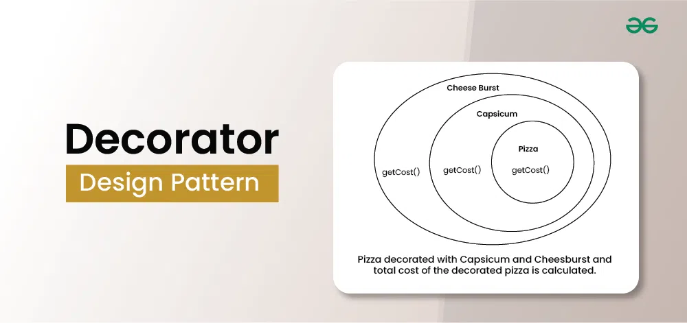
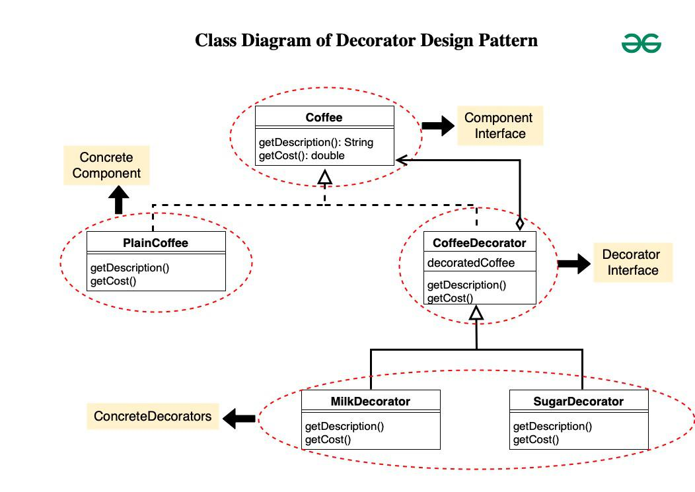

## Decorator Design Pattern
The Decorator Design Pattern is a structural design pattern that allows behavior to be added to individual objects dynamically, without affecting the behavior of other objects from the same class. It involves creating a set of decorator classes that are used to wrap concrete components.



#### Real-World Example of Decorator Design Pattern
*Consider a video streaming platform where users can watch movies and TV shows. Each video content may have additional features or options available, such as subtitles, language preferences, video quality options, and audio enhancements.*

- In this scenario, the base component is the video content itself, while the decorators represent the various additional features that users can enable or customize.
- For example, a user might select the option to enable subtitles, change the language of the audio track, or adjust the video quality settings.
- Each of these options acts as a decorator that enhances the viewing experience without altering the underlying video content.
- By using the Decorator pattern, the streaming platform can dynamically apply these additional features to the video content based on user preferences, providing a customizable viewing experience.

**Key Components of the Decorator Design Pattern**
1. **Component Interface**: This is an abstract class or interface that defines the common interface for both the concrete components and decorators. It specifies the operations that can be performed on the objects.
2. **Concrete Component**: These are the basic objects or classes that implement the Component interface. They are the objects to which we want to add new behavior or responsibilities.
3. **Decorator**: This is an abstract class that also implements the Component interface and has a reference to a Component object. Decorators are responsible for adding new behaviors to the wrapped Component object.
4. **Concrete Decorator**: These are the concrete classes that extend the Decorator class. They add specific behaviors or responsibilities to the Component. Each Concrete Decorator can add one or more behaviors to the Component.

### Example
#### Coffee Shop

Component Interface(Coffee)
```java
public interface Coffee {
    String getDescription();
    double getCost();
}
```
ConcreteComponent(PlainCoffee)
```java
public class PlainCoffee implements Coffee {
    @Override
    public String getDescription() {
        return "Plain Coffee";
    }

    @Override
    public double getCost() {
        return 2.0;
    }
}
```

Decorator(CoffeeDecorator)
```java
public abstract class CoffeeDecorator implements Coffee {
    protected Coffee decoratedCoffee;

    public CoffeeDecorator(Coffee decoratedCoffee) {
        this.decoratedCoffee = decoratedCoffee;
    }

    @Override
    public String getDescription() {
        return decoratedCoffee.getDescription();
    }

    @Override
    public double getCost() {
        return decoratedCoffee.getCost();
    }
}
```

Concrete Decorators
```java
// MilkDecorator.java
public class MilkDecorator extends CoffeeDecorator {
    public MilkDecorator(Coffee decoratedCoffee) {
        super(decoratedCoffee);
    }

    @Override
    public String getDescription() {
        return decoratedCoffee.getDescription() + ", Milk";
    }

    @Override
    public double getCost() {
        return decoratedCoffee.getCost() + 0.5;
    }
}

// SugarDecorator.java
public class SugarDecorator extends CoffeeDecorator {
    public SugarDecorator(Coffee decoratedCoffee) {
        super(decoratedCoffee);
    }

    @Override
    public String getDescription() {
        return decoratedCoffee.getDescription() + ", Sugar";
    }

    @Override
    public double getCost() {
        return decoratedCoffee.getCost() + 0.2;
    }
}
```

demo Code
```java
// Main.java
public class Main {
    public static void main(String[] args) {
        // Plain Coffee
        Coffee coffee = new PlainCoffee();
        System.out.println("Description: " + coffee.getDescription());
        System.out.println("Cost: $" + coffee.getCost());

        // Coffee with Milk
        Coffee milkCoffee = new MilkDecorator(new PlainCoffee());
        System.out.println("\nDescription: " + milkCoffee.getDescription());
        System.out.println("Cost: $" + milkCoffee.getCost());

        // Coffee with Sugar and Milk
        Coffee sugarMilkCoffee = new SugarDecorator(new MilkDecorator(new PlainCoffee()));
        System.out.println("\nDescription: " + sugarMilkCoffee.getDescription());
        System.out.println("Cost: $" + sugarMilkCoffee.getCost());
    }
}
```
Output
```
Description: Plain Coffee
Cost: $2.0

Description: Plain Coffee, Milk
Cost: $2.5

Description: Plain Coffee, Milk, Sugar
Cost: $2.7
```

### Pizza Shop


