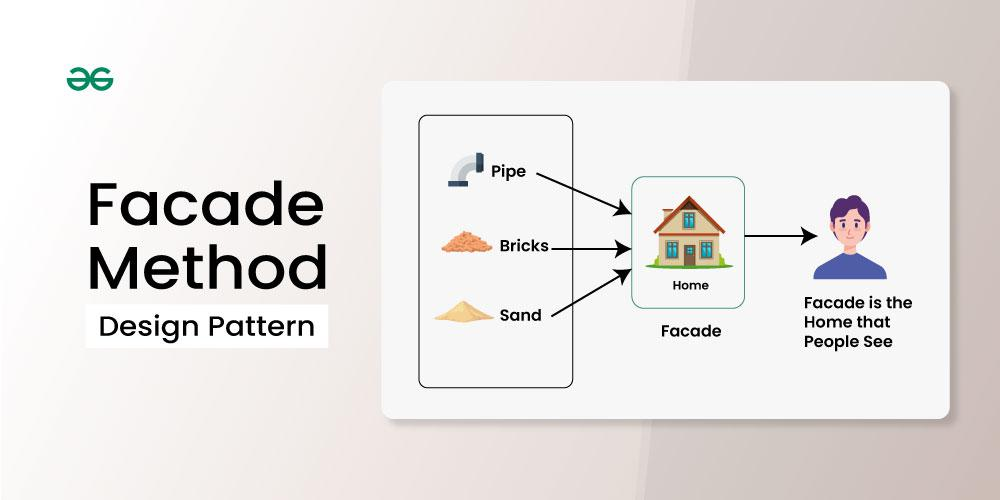
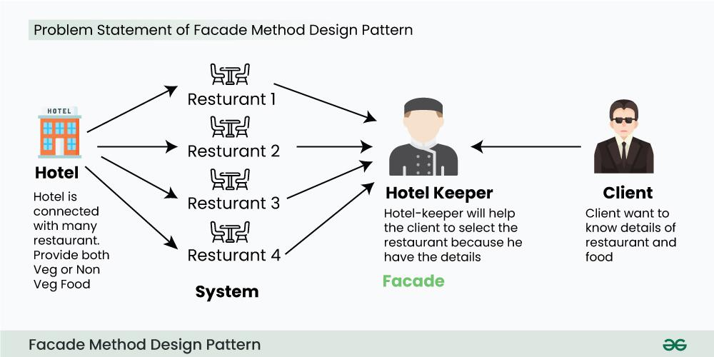

## Facade Method Design Pattern
Facade Method Design Pattern is a part of the Gang of Four design patterns and it is categorized under Structural design patterns. Before we dive deep into the details of it, imagine a building, the facade is the outer wall that people see, but behind it is a complex network of wires, pipes, and other systems that make the building function. The facade pattern is like that outer wall. It hides the complexity of the underlying system and provides a simple interface that clients can use to interact with the system.



*Facade Method Design Pattern provides a unified interface to a set of interfaces in a subsystem. Facade defines a high-level interface that makes the subsystem easier to use.*

### Example
*Let’s consider a hotel. This hotel has a hotel keeper. There are a lot of restaurants inside the hotel e.g. Veg restaurants, Non-Veg restaurants, and Veg/Non Both restaurants. You, as a client want access to different menus of different restaurants. You do not know what are the different menus they have. You just have access to a hotel keeper who knows his hotel well. Whichever menu you want, you tell the hotel keeper and he takes it out of the respective restaurants and hands it over to you.*



Hotel Interface
```java
public interface Hotel {
    public Menus getMenus();
}
```

Non-Veg Restaurant
```java
public class NonVegRestaurant implements Hotel {
 
    public Menus getMenus()
    {
        NonVegMenu nv = new NonVegMenu();
        return nv;
    }
}
``` 
Veg Restaurant

```java
public class VegRestaurant implements Hotel {
 
    public Menus getMenus()
    {
        VegMenu nv = new VegMenu();
        return nv;
    }
}
``` 
VegNonBothRestaurant
```java
public class VegNonBothRestaurant implements Hotel {
 
    public Menus getMenus()
    {
        Both b = new Both();
        return b;
    }
}
```

HotelKeeper (Facade Interface)
```java
public interface HotelKeeper {
   
 
  public VegMenu getVegMenu();
  public NonVegMenu getNonVegMenu();
  public Both getVegNonMenu();
 
}
```

HotelKeeperImplementation
```java
public class HotelKeeperImplementation implements HotelKeeper {
 
    public VegMenu getVegMenu()
    {
        VegRestaurant v = new VegRestaurant();
        VegMenu vegMenu = (VegMenu)v.getMenus();
        return vegMenu;
    }
 
    public NonVegMenu getNonVegMenu()
    {
        NonVegRestaurant v = new NonVegRestaurant();
        NonVegMenu NonvegMenu = (NonVegMenu)v.getMenus();
        return NonvegMenu;
    }
 
    public Both getVegNonMenu()
    {
        VegNonBothRestaurant v = new VegNonBothRestaurant();
        Both bothMenu = (Both)v.getMenus();
        return bothMenu;
    }
}
```

Client
```java
public class Client
{
    public static void main (String[] args)
    {
        HotelKeeper keeper = new HotelKeeperImplementation();
         
        VegMenu v = keeper.getVegMenu();
        NonVegMenu nv = keeper.getNonVegMenu();
        Both = keeper.getVegNonMenu();
 
    }
}
```


- to be used when we have to hide system complexity from Client
- we should not force the client to go through facade, they can directly go to the sub-system also
- In case of Client talking directly to the sub-system, changes happening in the sub-system will force the client to change whereas with facade in between it will be responsibility of Facade to absorb the impact of the change
