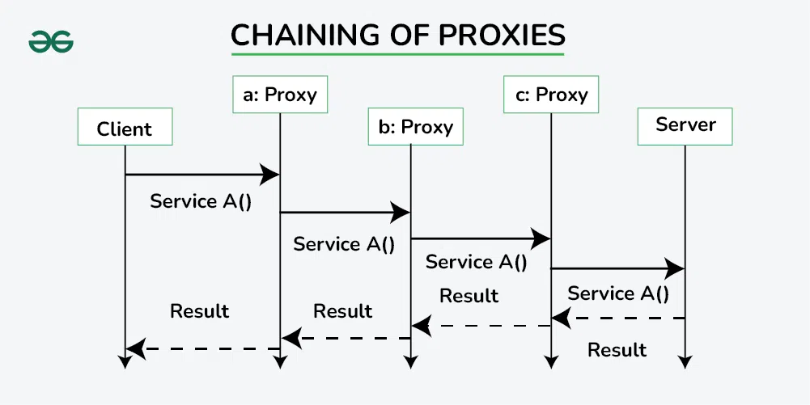
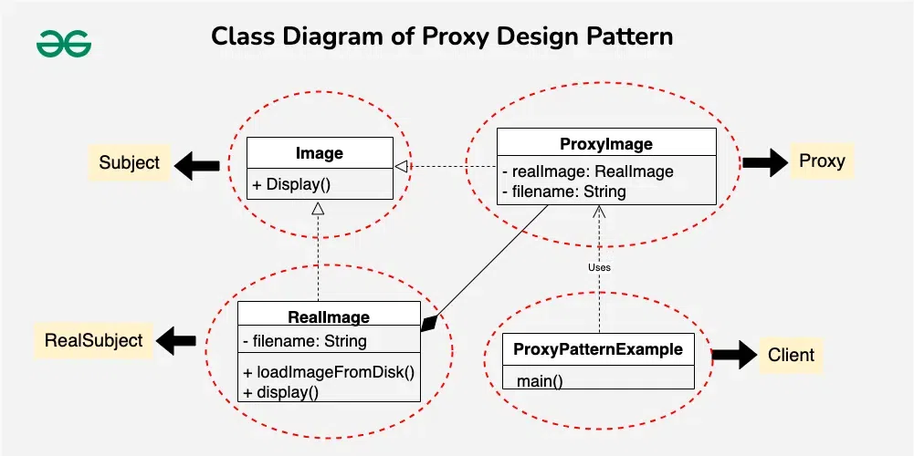

## Proxy Design Pattern

The Proxy Design Pattern is a structural design pattern that provides a surrogate or placeholder for another object to control access to it. This pattern is useful when you want to add an extra layer of control over access to an object. The proxy acts as an intermediary, controlling access to the real object.

*A real-world example can be a cheque or credit card as a proxy for what is in our bank account. It can be used in place of cash and provides a means of accessing that cash when required.*

**Chaining of Proxies**
Chaining proxies in the Proxy Design Pattern means connecting them in a sequence, where each proxy adds its behavior or checks before passing the request to the next proxy or the real object. It’s like forming a chain of guards, each responsible for a specific task.


#### Components of Proxy Design Pattern
1. **Subject**
The Subject is an interface or an abstract class that defines the common interface shared by the RealSubject and Proxy classes. It declares the methods that the Proxy uses to control access to the RealSubject.

- Declares the common interface for both RealSubject and Proxy.
- Usually includes the methods that the client code can invoke on the RealSubject and the Proxy.
2. **RealSubject**
The RealSubject is the actual object that the Proxy represents. It contains the real implementation of the business logic or the resource that the client code wants to access.

- It Implements the operations declared by the Subject interface.
- Represents the real resource or object that the Proxy controls access to.
3. **Proxy**
The Proxy acts as a surrogate or placeholder for the RealSubject. It controls access to the real object and may provide additional functionality such as lazy loading, access control, or logging.

- Implements the same interface as the RealSubject (Subject).
- Maintains a reference to the RealSubject.
- Controls access to the RealSubject, adding additional logic if necessary.

### Example
*Consider a scenario where your application needs to load and display images, and you want to optimize the image loading process. Loading images from disk or other external sources can be resource-intensive, especially if the images are large or stored remotely.*



Image Interface (Subject)
```java

interface Image {
    void display();
}
```

RealImage (Real Subject)
```java
class RealImage implements Image {
    private String filename;
 
    public RealImage(String filename) {
        this.filename = filename;
        loadImageFromDisk();
    }
 
    private void loadImageFromDisk() {
        System.out.println("Loading image: " + filename);
    }
 
    public void display() {
        System.out.println("Displaying image: " + filename);
    }
}
```
Proxy
```java

class ProxyImage implements Image {
    private RealImage realImage;
    private String filename;
 
    public ProxyImage(String filename) {
        this.filename = filename;
    }
 
    public void display() {
        if (realImage == null) {
            realImage = new RealImage(filename);
        }
        realImage.display();
    }
}
```

Client
```java
public class ProxyPatternExample {
    public static void main(String[] args) {
        Image image = new ProxyImage("example.jpg");
 
        // Image will be loaded from disk only when display() is called
        image.display();
 
        // Image will not be loaded again, as it has been cached in the Proxy
        image.display();
    }
}
```
Output
```
Loading image: example.jpg
Displaying image: example.jpg
Displaying image: example.jpg
```

### Why do we need Proxy Design Pattern?
The Proxy Design Pattern is employed to address various concerns and scenarios in software development, providing a way to control access to objects, add functionality, or optimize performance.

- **Lazy Loading**:
    - One of the primary use cases for proxies is lazy loading. In situations where creating or initializing an object is resource-intensive, the proxy delays the creation of the real object until it is actually needed.
    - This can lead to improved performance by avoiding unnecessary resource allocation.
- **Access Control**:
    - Proxies can enforce access control policies.
    - By acting as a gatekeeper to the real object, proxies can restrict access based on certain conditions, providing security or permission checks.
- **Protection Proxy**:
    - Protection proxies control access to a real object by adding an additional layer of security checks.
    - They can ensure that the client code has the necessary permissions before allowing access to the real object.
- **Caching**:
    - Proxies can implement caching mechanisms to store results or resources.
    - This is particularly useful when repeated operations on a real object can be optimized by caching previous results, avoiding redundant computations or data fetching.
- **Logging and Monitoring**:
    - Proxies provide a convenient point to add logging or monitoring functionalities.
    - By intercepting method calls to the real object, proxies can log information, track usage, or measure performance without modifying the real object.


