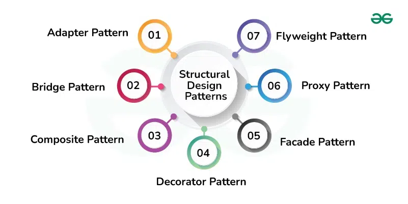

## Structural Design Patterns

*Structural Design Patterns are concerned with how classes and objects are composed to form larger structures. Structural class patterns use inheritance to compose interfaces or implementations.*

1. **Adapter Method Design Pattern**
The adapter pattern convert the interface of a class into another interface clients expect. Adapter lets classes work together that couldn’t otherwise because of incompatible interfaces.

2. **Bridge Method Design Pattern**
The bridge pattern allows the Abstraction and the Implementation to be developed independently and the client code can access only the Abstraction part without being concerned about the Implementation part.

3. **Composite Method Design Pattern**
Composite pattern is a partitioning design pattern and describes a group of objects that is treated the same way as a single instance of the same type of object. The intent of a composite is to “compose” objects into tree structures to represent part-whole hierarchies.

4. **Decorator Method Design Pattern**
It allows us to dynamically add functionality and behavior to an object without affecting the behavior of other existing objects within the same class. We use inheritance to extend the behavior of the class. This takes place at compile-time, and all the instances of that class get the extended behavior.

5. **Facade Method Design Pattern**
Facade Method Design Pattern provides a unified interface to a set of interfaces in a subsystem. Facade defines a high-level interface that makes the subsystem easier to use.

6. **Flyweight Method Design Pattern**
This pattern provides ways to decrease object count thus improving application required objects structure. Flyweight pattern is used when we need to create a large number of similar objects.

7. **Proxy Method Design Pattern**
Proxy means ‘in place of’, representing’ or ‘in place of’ or ‘on behalf of’ are literal meanings of proxy and that directly explains Proxy Design Pattern. Proxies are also called surrogates, handles, and wrappers. They are closely related in structure, but not purpose, to Adapters and Decorators.